#### 1. Эталонная модель взаимодействия открытых систем и стек TCP/IP.

модель OSI представляет собой семь уровней, грубо говоря, это означает, что электронное письмо при передаче с компьютера А на компьютер Б должно пройти семь стадий обработки сначала сверху вниз на компьютере А (то есть каким-то образом, за семь шагов, текст, который вы напечатали и видите в почтовом клиенте, превращается в поток битов) так, чтобы его можно было передать по проводам, а затем компьютер Б принимает этот поток битов и точно также за семь шагов превращает этот поток нулей и единиц в понятное письмо, которое сможет прочесть тот человек, которому было адресовано это письмо.

Каждый из этих уровней выполняет свои определенные задачи, на каждом уровне есть свои единицы измерения информации или тип данных – PDU (protocol data unit), это единицы измерения данных, которыми оперирует протокол на том или ином уровне, так, например, на уровнях с седьмого по пятый включительно PDU называется просто – данные, на транспортном уровне в случае протокола TCP данные представляются в виде сегментов, а в случае протокола UDP единицей измерения данных являются дейтаграммы или датаграммы, мне удобнее первый вариант. На сетевом уровне PDU называются пакетами, на канальном уровне – это кадры, а на физическом уровне – это последовательность нулей и единиц или просто биты.

Также стоит отметить, что условно уровни эталонной модели делятся на верхние и нижние:

физический, канальный и сетевой уровни можно отнести к нижним уровням или уровням среды передачи данных, в английской литературе это называется media layers;
а вот транспортный, сеансовый, представительский и уровень приложений относятся к host layers или к верхним уровням, ну или к уровням хоста.

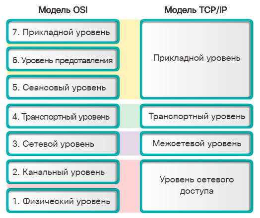

Физический уровень определяет параметры и характеристики среды передачи данных, а также описывает реальные сигналы, которые бегают по проводам или летают по воздуху. Канальный уровень определяет методы доступа физических устройств к ресурсам сети передачи данных, а также отвечает за проверку целостности данных.

На сетевом уровне происходит логическая адресация устройств компьютерной сети, а также определяется маршрут, по которому будут передаваться пакеты по сети, в добавок к этому сетевой уровень обеспечивает связь между разными сетями. Благодаря функциям сетевого уровня компьютер, находящийся в Австралии может взаимодействовать с узлом, находящимся в Европе.
Транспортный уровень реализует туннельную связь между двумя конечными узлами, то есть он отвечает за надежную передачу данных между удаленными узлами поверх ненадёжной сети, в котором в любой момент времени может случиться всё что угодно, также транспортный уровень позволяет компьютеру разделять трафик различных приложений, а еще он выполняет фрагментацию, то есть разбивает данные, получаемые с верхнего уровня на мелкие фрагменты.

Уровни выше транспортного нам не так интересны, но все же стоит отметить, что сеансовый уровень эталонной модели управляет сеансом связи, представительский уровень выполняет функцию переводчика, то есть он отвечает за то, что компьютер одного производителя поймет и сможет обработать формат данных, полученный от компьютера другого производителя, ну и на конец прикладной уровень в модели OSI 7 служит для взаимодействия с конечным потребителем услуги, то есть с человеком.

**0 уровень** – Физическая среда. Для реализации любого взаимодействия нужно физическое соединение между компьютерами.
Возможные линии связи: витая пара, коаксиальный кабель, оптоволокно, радиоизлучение, инфракрасное излучение.

**1 уровень** – Физическое управление. Этот уровень определяет механические (кабели и разъемы) и электрические соединения между компьютерами. Здесь описывается:

Способ передачи информации (основная полоса частот или модуляция несущей);
Скорость передачи и напряжение сигнала;
Топология сети (шина, кольцо, звезда и т.д.).
2 уровень – Канальный уровень. Формирует из данных, передаваемых уровнем "1" (биты), формирует специальные кадры и их последовательности.
Кадр выглядит так:
Адрес получателя | Адрес отправителя | Данные | Контрольные суммы

**На уровне "2"** так же осуществляется управление доступом к передающей среде, если несколько машин используют один и тот же кабель связи. Возможные решения:
 - Последовательный опрос;
 - Передача маркера;
 - Соперничество.

**3 уровень** – Сетевой уровень. Вводится для обеспечения соединения между несколькими сетями. Для работы в одной сети достаточно уровней "1" и "2". На сетевом уровне формируется виртуальная цепь (логическое соединение), связывающее компьютеры в различных сетях. Сетевой уровень формирует цепь, и выше лежащие уровни могут действовать так, как будто она существует в действительности. На сетевом уровне пользовательские сообщения разбиваются на пакеты определенной длины. На приемном конце из передаваемых пакетов опять собираются сообщения.

**4 уровень** – Транспортный уровень. Обеспечивает взаимодействие между процессами на удаленных машинах и сквозную транспортировку данных между двумя компьютерами, находящихся в сеансе общения. Здесь осуществляется нумерация пакетов, контроль пропусков и дублирований. В некоторых случаях естественная последовательность в процессе передачи может нарушиться, поэтому правилами транспортного уровня эта последовательность восстанавливается.

Таким образом, первые четыре уровня реализуют функции передачи данных (транспортные услуги). С помощью этих уровней обеспечивается передача битов сообщения от одного пользователя к другому, но не выполняет никаких манипуляций с этими битами. Остальные уровни связаны с обработкой данных.

**5 уровень** - Сеансовый уровень. На нем устанавливается и поддерживается диалог между процессами пользователей на различных WS. Здесь стандартизируются процессы установления сеанса и его завершения. Если возникает нарушение сеанса связи, уровень "5" возобновляет его без потери данных, а если это невозможно - прекращает его.

Существуют разновидности диалога:
1. Обмен по очереди;
2. Диалог с прерыванием друг друга.
Здесь же устанавливается продолжительность общения в диалоге.

**6 уровень** – Уровень представления данных. Осуществляет интерпретацию данных, передаваемых во время диалога. Осуществляется перекодировка символов, шифрование, сжатие, редактирование данных.

**7 уровень** – Прикладной уровень. Определяет работу прикладных программ. Операторские функции над сетью, передача почты (mail), работа с базами данных, FTP, HTTP, TELNET.

В реальных системах, четко определены и выдерживаются, как правило, первые четыре уровня, потому что они основные. Уровни "5"-"7" могут значительно отличатся у разных производителей.

Попытка нарушить изолированность слоев или упустить некоторые из них, с целью повышения производительности, может привести к невозможности дальнейшего развития системы.

Недостатком расслоения является увеличение накладных расходов: увеличивается как длина передаваемого сообщения, так и растет число команд, необходимых для управления передачей.

#### 2. Серверы и серверное ПО.
Сервер

 * Клиент-серверная архитектура ПО.
 * Сервер - программный компонент вычислительной системы, выполняющий сервисные (обслуживающие) функции по запросу клиента, предоставляя ему доступ к определённым ресурсам или услугам.
 Сервер — это объект, предоставляющий сервис другим объектам сети по их запросам. Сервис – это процесс обслуживания клиентов.

Сервер работает по заданиям клиентов и управляет выполнением их заданий. После выполнения каждого задания сервер посылает полученные результаты клиенту, пославшему это задание.

Сервисная функция в архитектуре клиент – сервер описывается комплексом прикладных программ, в соответствии с которым выполняются разнообразные прикладные процессы.

Процесс, который вызывает сервисную функцию с помощью определенных операций, называется клиентом. Им может быть программа или пользователь. Клиенты – это рабочие станции, которые используют ресурсы сервера и предоставляют удобные интерфейсы пользователя. Интерфейсы пользователя это процедуры взаимодействия пользователя с системой или сетью.

Для того чтобы компьютер мог выступать в роли сетевого сервера необходимо установить серверную часть сетевой операционной системы, которая позволяет поддерживать ресурсы и распространять их среди сетевых клиентов. Важным вопросом для сетевых серверов является возможность ограничить доступ к сетевым ресурсам. Это называется сетевой защитой (network security). Она предоставляет средства управления над тем, к каким ресурсам могут получить доступ пользователи, степень этого доступа, а также, сколько пользователей смогут получить такой доступ одновременно. Этот контроль обеспечивает конфиденциальность и защиту и поддерживает эффективную сетевую среду.

В дополнение к обеспечению контроля над сетевыми ресурсами сервер выполняет следующие функции:

— предоставляет проверку регистрационных имен (logon identification) для пользователей;

— управляет пользователями и группами;

— хранит инструменты сетевого администрирования для управления, контроля и аудита;

обеспечивает отказоустойчивость для защиты целостности сети.

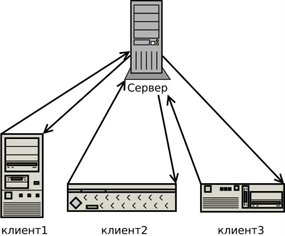

Стандартные серверы

 * Универсальные серверы - не предоставляют никаких услуг самостоятельно, а предоставляют серверам услуг упрощённый интерфейс к ресурсам межпроцессного взаимодействия и/или унифицированный доступ клиентов к различным услугам. (Inetd, RPC)
 * Маршрутизации
 * Сетевых служб (DHCP, DNS, RADIUS, VPN)
 * Информационных служб (time, finger, SNMP, NTP)
 * Файловые серверы (FTP, SFTP, HTTP, SMB, NFS)
 * Серверы доступа к данным (LDAP, *SQL, NoSQL)
 * Службы обмена сообщениями (SMTP, POP3, IMAP, Jabber, NNTP, IRC)
 * Серверы удаленного доступа (telnet, SSH, RSH, X-Window System, RDP)
 * Серверы приложений (Игровые, Стрим, …)

 Состав серверного ПО
 * Сервер приложения
 * Файловый сервер
 * Сервер доступа к данным
 * Сервер обмена сообщениями
 * Сетевые службы
 * Информационные службы
 * Удаленный доступ
 * Универсальные серверы

#### 3. Стеки LAMP, MEAN и др.

LAMP – это:

 * серверная ОС Linux для выполнения нужных задач;
 * веб-сервер Apache, для которого создано множество дополнительных модулей, которые решают вопрос совместной работы веб-сервера и сценариев написанных на самых разных языках программирования;
 * серверный язык динамических сценариев PHP (либо Perl);
 * СУБД MySQL, которая демонстрирует отличную скорость выполнения SQL-запросов и идеально подходит для малых и средних проектов. MySQL работает на Unix и Windows, отличается особенным удобством в работе.

Как весомое преимущество данной сборки: она замечательно подходит для быстрого развертывания приложения, из-за простой конфигурации, но все же она дает мало функций в плане масштабируемости и изоляции компонентов.

Среди недостатков подобной сборки следует выделить следующие:

Приложение и база данных используют одни и те же ресурсы сервера (CPU, память, I/O и т.д.), что дает низкую производительность и затрудняет определение источника (приложение или база данных) этой проблемы. Так же есть помехи в осуществлении горизонтального масштабирования.

MEAN — это больше, чем простая перестановка начальных букв и новых технологий. Смещение базовой платформы с ОС (Linux) к среде исполнения JavaScript (Node.js) несет с собой независимость от ОС: Node.js работает на Windows® и OS X так же, как и на Linux.

Node.js заменяет Apache из стека LAMP. Но Node.js — это гораздо больше, чем просто веб-сервер. На самом деле готовое приложение не развертывается на отдельном веб-сервере; вместо этого сам веб-сервер включается в приложение и автоматически устанавливается в составе стека MEAN. В результате процесс развертывания значительно упрощается, так как требуемая версия веб-сервера явно определена вместе с остальными зависимостями времени выполнения.

Переход от традиционной базы данных, такой как MySQL, к бессхемному, документо-ориентированному NoSQL-хранилищу, такому как MongoDB, представляет собой фундаментальный сдвиг в стратегии персистенции. Программист тратит меньше времени на написание операторов SQL и больше — на написание функций map/reduce на JavaScript. При этом исключаются огромные пласты логики преобразования, так как MongoDB изначально выдает формат JavaScript Object Notation (JSON). В результате предельно упрощается написание веб-сервисов REST.

Но главный сдвиг между LAMP и MEAN заключается в переходе от традиционного генерирования страниц на стороне сервера к ориентации на одностраничные приложения (SPA) на стороне клиента. Express позволяет управлять и маршрутизацией / генерацией страниц на стороне сервера, но теперь — благодаря AngularJS — упор делается на представления на стороне клиента. Эта перемена означает не просто перенос ваших артефактов модель-представление-контроллер (MVC) с сервера в клиентское устройство. Это также скачок от менталитета синхронности к менталитету, носящему событийно-управляемый, принципиально асинхронный характер. И, пожалуй, самое главное, — это движение от странично-ориентированных приложений к компонентно-ориентированным.

Стек MEAN не «заточен» на мобильные приложения — AngularJS одинаково хорошо работает на настольных компьютерах и ноутбуках, смартфонах и планшетах и даже на смарт-телевизорах, — но он и не относится к мобильным устройствам как к гражданам второго сорта. И тестирование больше не откладывается на потом: с помощью платформ тестирования мирового класса, таких как MochaJS, JasmineJS и KarmaJS, можно писать тщательные и всеобъемлющие наборы тестов для своих MEAN-приложений.

LEMP - это аналог популярного стека LAMP, используемого для разработки и развертывания веб-приложений. Традиционно LAMP состоит из Linux, Apache, MySQL и PHP. Благодаря своей модульной природе компоненты легко могут быть заменены. В LEMP Apache заменяется легким, но мощным Nginx, который может обеспечить более предсказуемую производительность при высоких нагрузках.

Apache использует разветвленное много потоковое решение, другими словами поддерживает связь с каждым клиентом по отдельности. Nginxже, использует неблокирующий цикл событий, если проще, то он объединяет пользователей, которые работают асинхронно.
Nginx создает один поток, и сразу же обрабатывает его, не создавая лишние процессы. Потому нагрузки на сервер не настолько велика. А чем меньше нагрузки на само "железо", тем быстрее и стабильнее работает система в целом.

#### 4. Противоречия между целями бизнеса и разработчиков. Поведение или архитектура.

Цель архитектуры программного обеспечения – уменьшить человеческие трудозатраты на создание и сопровождение системы.

Идеальная система полностью решает цели и задачи бизнеса.

Бизнес цели: `планируемы`, `измеримы`, `автоматизируемы`.

Например:
- Продажа `x` товаров на сайте в месяц;
- Предоставление сервиса 99,99% времени;
- Обработка x миллионов заказов в месяц, с ростом 10%;
- Вывод новых фич два раза в неделю;
- Исправление мажорных багов за 24 часа;

##### Предсказуемость и устойчивость целей бизнеса и проектной команды

Поведение v Архитектура

- Бизнес-цели максимально быстро с ущербом для качества.
> Мы сможем навести порядок потом, нам бы только выйти на рынок!
- Надо пилить новые фичи;
- Нарастает технический долг;
- Беспорядок возрастает;
- Вместо исправления беспорядок переносится с места на место;
- Грязный код может помочь быстро выйти на рынок, но в действительности он затормозит движение в долгосрочной перспективе;
- Поведение – удовлетворение бизнес-требованиям по функциональности;
- Архитектура – удовлетворение требованиям качества (сопровождаемость, изменяемость, надежность, и т.д.).

Так что всё-таки важнее?

Правильный ответ: Архитектура.

Если функциональные требования поменялись, а изменения вносить невозможно – правильно работавшая ранее программа становится бесполезна. Если программа работает неправильно, но легко поддается изменениям, то её можно сделать правильной.

Идеальная архитектура:
- Очевидный запланированный путь развития с ростом популярности и трафика (реакция на изменяющиеся требования);
- Устойчивость к сбоям, избыточность и эластичность (сбой не сюрприз, а естественная часть физики ИТ);
- Максимальная независимость подсистем (масштабирование, апгрейд, замена);
- Электронное описание инфраструктуры, Infrastructure as a Code (автоматическое воссоздание окружений).

Традиционный процесс релиза:

- Разработчик размещает готовый код в репозиторий;
- Тестовые инженеры прогоняют код через тесты;
- Если тесты пройдены, выпускающий инженер строит пакеты для доставки ПО. Большинство файлов из репозитория, но некоторые – из сторонних источников, генерируемы и т.д.;
- Создается тестовое окружение;
- Тестовые инженеры тестируют взаимодействие подсистем;
- Если тесты пройдены – код в продакшн;
- Системные администраторы обновляют код систем, следя за сбоями;
- При наличии сбоев – откат до предыдущей версии.

Ошибки на любом этапе - возврат на предыдущий этап. Много изменений разрабатывается и тестируется одновременно. Пакетные мега-релизы несколько раз в год. Чем больше одновременных изменений – тем больше риски.

Релиз в идеальной системе:
- Сборка, тестирование, выпуск, доставка автоматизированы;
- Вместо мега-релизов – микро-релизы, хоть 100 раз в день;
- Как только разработчик размещает код в репозитории, система запускает серию автоматических тестов основного функционала;
- Если тесты пройдены, автоматически собираются пакеты;
- Запускается создание тестового окружения без человеческого вмешательства (IaaC);
- Запускается серия автотестов на тестовом окружении;
- При успешном прохождении пакеты выкатываются с продакшн;
- Тестовые окружения строятся так же, как и продакшн, минимум различий;
-  При обнаружении ошибки на любом из этапов – остановка других релизов до исправления ошибки;
- За счет минимального объема изменений – исправление ошибок быстрое, движение вперед не задерживается.

#### 5. Три уровня архитектуры программной системы.

Архитектура программной системы состоит из:

1. Компонентов 
2. Программных структур среднего уровня
3. Чистого кода

Следует заметить, что базисом такой архитектуры является чистый код. Но есть вопрос - как писать чистый код? На этот вопрос отвечают парадигмы программирования. Парадигмы программирования:
1. Структурное программирование - упрвление структурами и конструкциями кода
2. Объектно-ориентированное программирование - класса и объекты, наследование, полиморфизм, инкапсуляция.
3. Функциональное программирование - все о функциях, функции высшего порядка, чистые функции

Программные структуры среднего уровня - основа для компонентов. Они должны быть просты и понятны. Структуры должны создаваться соответствуя принципам SOLID.

Компоненты - высший уровень в архитектуре. Компонент - единица развертывания. Компоненты должны следовать принципам связности компонентов и принципам сочетаемости компонентов.

#### 6. Парадигмы программирования: структурное. Ограничения, выгода.

Сущность структурного подхода к разработке ИС заключается в ее декомпозиции (разбиении) на автоматизируемые функции: система разбивается на функциональные подсистемы, которые в свою очередь делятся на подфункции, подразделяемые на задачи и так далее.
Процесс разбиения продолжается вплоть до конкретных процедур. При этом автоматизируемая система сохраняет целостное представление, в котором все составляющие компоненты взаимоувязаны. При разработке системы "снизу-вверх" от отдельных задач ко всей системе целостность теряется, возникают проблемы при информационной стыковке отдельных компонентов.
Все наиболее распространенные методологии структурного подхода базируются на ряде общих принципов. В качестве двух базовых принципов используются следующие:
1. **принцип "разделяй и властвуй"** - принцип решения сложных проблем путем их разбиения на множество меньших независимых задач, легких для понимания и решения;
2. **принцип иерархического упорядочивания** - принцип организации составных частей проблемы в иерархические древовидные структуры с добавлением новых деталей на каждом уровне.

Выделение двух базовых принципов не означает, что остальные принципы являются второстепенными, поскольку игнорирование любого из них может привести к непредсказуемым последствиям (в том числе и к провалу всего проекта). Основными из этих принципов являются следующие:
1. **принцип абстрагирования** - заключается в выделении существенных аспектов системы и отвлечения от несущественных;
2. **принцип формализации** - заключается в необходимости строгого методического подхода к решению проблемы;
3. **принцип непротиворечивости** - заключается в обоснованности и согласованности элементов;
4. **принцип структурирования данных** - заключается в том, что данные должны быть структурированы и иерархически организованы.

**Преимущества:** 
- Легко распределять работу между программистами
- Естественные контрольные точки
- Легко выявлять ошибки
- Легко поддается тестированию (комплексное тестирование)
- Раннее начало процесса кодирования
- Снижается вероятность допустить логическую ошибку
- Упрощенное чтение кода

**Недостатки:**
- Отсутствие гибкости системы. После некоторого количества модификаций происходит смещение уровней абстракции, нарушается структура, что приводит к потере надежности (сопровождение затруднено и много стоит)
- Сложно изменить формы данных и структур

#### 7. Парадигмы программирования: объектно-ориентированное. Ограничения, выгода.

**Объектно-ориентированное программирование (ООП**) — методология программирования, основанная на представлении программы в виде совокупности объектов, каждый из которых является экземпляром определённого класса, а классы образуют иерархию наследования.
К основным принципам ООП относятся:
1. **Полиморфизм** - способность функции одинаково обрабатывать данные разных типов.
2. **Инкапсуляция** – механизм позволяющий связывать данные и методы, работающие с этими данными, в единый объект и скрыть реализацию от пользователя.
3. **Абстракция** — это использование только тех характеристик объекта, которые с достаточной точностью представляют его в данной системе. Основная идея состоит в том, чтобы представить объект минимальным набором полей и методов и при этом с достаточной точностью для решаемой задачи.
4. **Наследование** – принцип ООП, позволяющий описать новый класс на основе уже существующего (родительского), при этом свойства и функциональность родительского класса заимствуются новым классом.

**Преимущества ООП**:
- Легкая расширяемость
- Сокращение количества межмодульных вызовов и уменьшение объемов информации, передаваемой между модулями.
- Увеличивается показатель повторного использования кода.

**Недостатки ООП**:
- Резко увеличивается время на анализ и проектирование систем
- Увеличение времени выполнения
- Сложность распределения работ на начальном этапе

#### 8. Парадигмы программирования: функциональное. Ограничения, выгода.

**Функциональное программирование** — парадигма программирования, в которой процесс вычисления трактуется как вычисление значений функций в математическом понимании последних. 
Основные принципы функционального программирования:
1. **Все функции — первого класса и высшего порядка**
	Для того, чтобы функция была первоклассной, у неё должна быть возможность быть объявленной в виде переменной. Это позволяет управлять функцией как обычным типом данных и в то же время исполнять её.
Функции высшего порядка же определяются как функции, принимающие другую функцию как аргумент или возвращающие функцию. Типичными примерами таких функций являются map и filter.
2. **Переменные неизменяемы**
	 В функциональном программировании вы не можете изменить переменную после её инициализации. Вы можете создавать новые, но не можете изменять существующие — и благодаря этому вы можете быть уверены, что никакая переменная не изменится.
3. **Все функции — чистые**
	Чистыми называют функции, которые не имеют побочных эффектов ввода-вывода и памяти (они зависят только от своих параметров и возвращают только свой результат)
4. **Ленивые вычисления**
	Ленивое вычисление подразумевает, что все значения инициализируются в момент обращения.
5. **Функциональное программирование основано на лямбда-исчислении.** 
	При вызове все функции проходят процесс каррирования. Он заключается в следующем: если вызывается функция с несколькими аргументами, то сперва она будет выполнена лишь с первым аргументом и вернёт новую функцию, содержащую на 1 аргумент меньше, которая будет немедленно вызвана. Этот процесс рекурсивен и продолжается до тех пор, пока не будут применены все аргументы, возвращая финальный результат. Поскольку функции являются чистыми, это работает.

**Преимущесвта ФП:**
- Возможности параллелизма (Поскольку отсутствие побочных эффектов гарантировано, в любом вызове функции всегда допустимо параллельное вычисление двух различных параметров — порядок их вычисления не может оказать влияния на результат вызова.)
- Повышение надёжности кода ( Любая функция работает только с локальными данными и работает с ними всегда одинаково, независимо от того, где, как и при каких обстоятельствах она вызывается. Невозможность мутации данных при пользовании ими в разных местах программы исключает появление труднообнаруживаемых ошибок)

**Недостатки ФП:**
- Требуется наличие высокоэффективного сборщика мусора. (Из-за отсутствия присваиваний появляется необходимость постоянного выделения и освобождения памяти)
- Так же необходимо наличие больших вычислительных мощностей ( Из-за особенностей работы лямбда-исчислений происходит множественный вызов функций, что замедляет выполнения программы) 

#### 9. SOLID: принцип единственной ответственности (SRP), принцип открытости-закрытости (OCP).

**Принцип единственной ответственности (Single Responsibility Principle)**

Данный принцип гласит: **никогда не должно быть больше одной причины изменить класс.**

На каждый объект возлагается одна обязанность, полностью инкапсулированная в класс. Все сервисы класса направлены на обеспечение этой обязанности. 

Такие классы всегда будет просто изменять, если это понадобится, потому что понятно, за что класс отвечает, а за что — нет. То есть можно будет вносить изменения и не бояться последствий — влияния на другие объекты. А еще подобный код гораздо проще тестировать, ведь вы покрываете тестами одну функциональность в изоляции от всех остальных. Если класс имеет несколько назначений, его нужно разделить на отдельные классы.

**Принцип открытости-закрытости (Open Closed Principle)**

Этот принцип описывают так: **программные сущности (классы, модули, функции и т.п.) должны быть открыты для расширения, но закрыты для изменения.** 

Это означает, что должна быть возможность изменять внешнее поведение класса, не внося физические изменения в сам класс. Следуя этому принципу, классы разрабатываются так, чтобы для подстройки класса к конкретным условиям применения было достаточно расширить его и переопределить некоторые функции. 

Поэтому система должна быть гибкой, с возможностью работы в переменных условиях без изменения исходного кода.

#### 10. SOLID: принцип подстановки Барбары Лисков (LSP), принцип разделения интерфейсов (ISP).

**Принцип подстановки Барбары Лисков (Liskov’s Substitution Principle)**

Это вариация принципа открытости/закрытости. Его можно описать так: **объекты в программе можно заменить их наследниками без изменения свойств программы.** 

Это означает, что класс, разработанный путем расширения на основании базового класса, должен переопределять его методы так, чтобы не нарушалась функциональность с точки зрения клиента. То есть, если разработчик расширяет ваш класс и использует его в приложении, он не должен изменять ожидаемое поведение переопределенных методов. 

Подклассы должны переопределять методы базового класса так, чтобы не нарушалась функциональность с точки зрения клиента.

**Принцип разделения интерфейсов (Interface Segregation Principle)**

Характеризуется следующим утверждением: **клиенты не должны быть вынуждены реализовывать методы, которые они не будут использовать.** 

Принцип разделения интерфейсов говорит о том, что слишком «толстые» интерфейсы необходимо разделять на более мелкие и специфические, чтобы клиенты мелких интерфейсов знали только о методах, необходимых в работе. В итоге, при изменении метода интерфейса не должны меняться клиенты, которые этот метод не используют.

#### 11. SOLID: принцип инверсии зависимостей (DIP).

**Принцип инверсии зависимостей (Dependency Inversion Principle)**

Этот принцип SOLID описывают так: **зависимости внутри системы строятся на основе абстракций.**

Модули верхнего уровня не зависят от модулей нижнего уровня. Абстракции не должны зависеть от деталей. Детали должны зависеть от абстракций. 

Программное обеспечение нужно разрабатывать так, чтобы различные модули были автономными и соединялись друг с другом с помощью абстракции. Применяя этот принцип, одни модули можно легко заменять другими, всего лишь меняя модуль зависимости, и тогда никакие перемены в низкоуровневом модуле не повлияют на высокоуровневый.

#### 12. Принципы связности компонентов. Их противоречия.

**Компоненты** — это единицы развертывания. Они представляют наименьшие сущности, которые можно развертывать в составе системы.Компоненты используются повторно, разрабатываются и развертываются независимо друг от друга.

Принципы связности компонентов:

- **REP: Reuse/Release Equivalence Principle — принцип эквивалентности повторного использования и релиза;**

Все классы и модули, составляющие компонент, выпускаются вместе, получают номер версии и общую документацию.

- **CCP: Common Closure Principle — принцип согласованного изменения;**

Собирайте вместе все, что изменяется по одной причине и в одно время. Разделяйте все, что изменяется в разное время и по разным причинам.

Это принцип единственной ответственности (SRP), перефразированный для компонентов. Так же, как принцип SRP, гласящий, что класс не должен иметь нескольких причин для изменения, CCP требует, чтобы компонент не имел нескольких причин для изменения.

Этот принцип так же тесно связан с принципом открытости/закрытости (Open Closed Principle; OCP). CCP развивает его идею, предписывая объединять в один компонент только классы, закрытые для одного и того же вида изменений. То есть увеличивает вероятность, что изменение требований повлечет необходимость изменения минимального количества компонентов.

Для большинства приложений простота сопровождения важнее возможности повторного использования. Если возникнет необходимость изменить код приложения, предпочтительнее, если все изменения будут сосредоточены в одном месте, а не разбросаны по нескольким компонентам. Если изменения ограничиваются единственным компонентом, нам потребуется развернуть только один, изменившийся компонент. Другие компоненты, не зависящие от измененного, не придется повторно проверять и развертывать.

- **CRP: Common Reuse Principle — принцип совместного повторного использования.**

Принцип CRP указывает, что классы, имеющие множественные зависимости друг от друга, должны включаться в один компонент. Классы, не имеющие тесной связи, не должны быть в одном компоненте.

Но принцип CRP говорит не только о том, какие классы должны включаться в компонент; он также сообщает, какие классы не должны объединяться: 

Когда один компонент использует другой компонент, между ними образуется зависимость. Использующий компонент может нуждаться только в одном классе из используемого компонента, но это не ослабляет зависимости. Из-за этой зависимости изменение используемого компонента часто влечет необходимость соответствующих изменений в использующем компоненте. Даже если в использующем компоненте ничего не нужно изменять, его почти наверняка потребуется повторно скомпилировать, протестировать и развернуть. То есть когда образуется зависимость от компонента, желательно, чтобы она распространялась на все классы в этом компоненте.

Иначе говоря, классы, включаемые в компонент, должны быть неотделимы друг от друга — чтобы нельзя было зависеть от одних и не зависеть от других. Иначе нам придется повторно развертывать больше компонентов, чем требуется, и тратить существенно больше усилий.

CRP является обобщенной версией принципа разделения интерфейсов (ISP). Обобщая, эти принципы можно объединить в один: Не создавайте зависимостей от чего-либо неиспользуемого.

**Противоречия принципов связности**


Принципы эквивалентности повторного использования (REP) и согласованного изменения (CCP) являются включительными: оба стремятся сделать компоненты как можно крупнее. Принцип повторного использования (CRP) — исключительный, стремящийся сделать компоненты как можно мельче. 

В начале разработки наибольшую важность имеет правая сторона треугольника, когда единственной жертвой является повторное использование. Но по мере развития и интеграции в другие проекты фокус начинает смещаться влево. То есть организация компонентов в проекте может изменяться с течением времени. Это больше связано с тем, как проект разрабатывается и используется, нежели с тем, что фактически этот проект делает.

#### 13. Принципы сочетаемости компонентов.

Следующие три принципа определяют правила взаимоотношений между компонентами. Это сново ведет к противоречиям между удобством разработки и логической организацией. 

- **Принцип ацикличности зависимостей**

Циклы в графе зависимостей компонентов недопустимы.

Проблема: одни и те же файлы с исходным кодом правят сразу несколько разработчиков -> Команда не в состоянии собрать стабильную версию проекта. Вместо этого разработчики правят и правят свой код, пытаясь заставить его работать с изменениями, сделанными кем-то другим.

Решение: разделении проекта на компоненты, которые могут выпускаться независимо. Компоненты становятся единицами работы, ответственность за которые можно возложить на одного разработчика или на небольшую группу. 

Когда разработчики добиваются работоспособности компонента, они выпускают новую версию для использования другими разработчиками. Когда появляется новая версия компонента, другие команды могут выбирать — сразу же задействовать новую версию или подождать. В результате ни одна команда не отдается на милость другим. Изменения в одном компоненте не оказывают немедленного влияния на другие команды. Каждая команда сама решает, когда начать адаптацию своего компонента для использования новой версии другого компонента. Кроме того, интеграция происходит небольшими шагами. Нет единого момента времени, когда все разработчики должны собраться вместе и интегрировать все, что они создали.

Однако чтобы добиться успеха, вы должны управлять структурой зависимостей компонентов. В ней не должно быть циклических зависимостей. Циклы приводят к значительному усложнению разработки и тестирования, определения порядка сборки компонентов.

Образовавшуюся циклическую зависимость всегда можно разорвать и привести граф зависимостей к форме ациклического ориентированного графа (DAG). Для этого используются два основных механизма:

1. Применить принцип инверсии зависимостей (Dependency Inversion Principle; DIP).
2. Создать новый компонент

Второе решение предполагает зависимость структуры компонентов от изменения требований. И действительно, с ростом приложения структура зависимостей компонентов растет и изменяется. Поэтому ее постоянно нужно проверять на предмет появления циклов. Когда образуются циклы, их нужно разрывать тем или иным способом. Иногда для этого приходится создавать новые компоненты, что заставляет разрастаться структуру зависимостей.

- Принцип устойчивых зависимостей

Зависимости должны быть направлены в сторону устойчивости.

Устойчивый компонент - компонент с множеством входящих зависимостей, потому что согласование изменений со всеми зависящими компонентами требует значительных усилий.

Компоненты, с большим трудом поддающиеся изменению (устойчивые компоненты), не должны зависеть от любых изменчивых компонентов. Иначе изменчивый компонент тоже трудно будет изменять. 

Не все компоненты должны быть устойчивыми. Если все компоненты в системе будут иметь максимальную устойчивость, такую систему невозможно будет изменить. Это нежелательная ситуация. В действительности структура компонентов должна проектироваться так, чтобы в ней имелись и устойчивые, и неустойчивые компоненты.

- Принцип устойчивости абстракций

Устойчивость компонента пропорциональна его абстрактности.

Принцип устойчивости абстракций (Stable Abstractions Principle; SAP) устанавливает связь между устойчивостью и абстрактностью. С одной стороны, он говорит, что устойчивый компонент также должен быть абстрактным, чтобы его устойчивость не препятствовала расширению, с другой — он говорит, что неустойчивый компонент должен быть конкретным, потому что неустойчивость позволяет легко изменять его код.

То есть стабильный компонент должен состоять из интерфейсов и абстрактных классов, чтобы его легко было расширять. Устойчивые компоненты, доступные для расширения, обладают достаточной гибкостью, чтобы не накладывать чрезмерные ограничения на архитектуру.

Принципы устойчивости абстракций (SAP) и устойчивых зависимостей (SDP) вместе соответствуют принципу инверсии зависимостей (DIP) для компонентов. Это верно, потому что принцип SDP требует, чтобы зависимости были направлены в сторону устойчивости, а принцип SAP утверждает, что устойчивость подразумевает абстрактность. То есть зависимости должны быть направлены в сторону абстрактности.

#### 14. Бизнес-логика и бизнес-правила.

 Термин Бизнес можно заменить на понятие Предметная Область(ПО), от которого и надо отталкиваться.
Предметная область (domain) – это часть реального мира занимающееся деятельностью, которая служит объектом автоматизации (не путайте данное определение с понятием модели предметной области, до нее мы еще доберемся).
Разберем данное определение предметной области на примере городской библиотеки, где библиотека является частью реального мира, а её деятельность – учет имеющихся книг и выдача их читателям. 

**Бизнес-логика** - это описание отношений, поведения между элементами предметной области, процессов, происходящих в той сфере, которая реализуется в приложении, и правил, по которым эти процессы происходят.
Бизнес-логика реализует бизнес-правила.

Бизнес-правила: 
- Критические бизнес-правила – имеют решающее значение для бизнеса и существуют вне приложения
- Критические бизнес-данные – без них не работают КБП
- Сущность (entity) – объект АС, воплощающий небольшой набор КБП, оперирующих КБД
- Вариант использования (use case) – способ использования АС, описывающий бизнес-правила, характерные именно для АС

**Бизнес-правило** – это положение, определяющее или ограничивающее какие-либо стороны бизнеса (предметной области). Его назначение – защитить структуру бизнеса, контролировать или влиять на его операции.
Бизнес-правила разделяют примерно на шесть основных категорий:

- Бизнес-термины – фундаментальная форма бизнес-правила. Это фразы, слова, аббревиатуры из предметной области. Обычно такие термины хранятся в документе под названием «бизнес глоссарий» или «словарь терминов». Примеры бизнес-терминов: читатель; книга; ISBN (англ. International Standard Book Number, сокращённо — англ. ISBN) — уникальный номер книжного издания; читательский абонемент – документ, где учитываются книги выданные читателю; и т.д.

- Факты (facts) — это верные утверждения о бизнесе. Зачастую они описывают связи и отношения между важными бизнес-терминами. Факты также называют инвариантами — неизменными истинами о сущности данных и их атрибутах. Бизнес-правила во многих случаях могут ссылаться на определенные факты, однако последние обычно не преобразуются напрямую в функциональные требования к программному обеспечению. Сведения о сущности данных, важных для системы, применяют в моделях данных, создаваемых аналитиком или архитектором базы данных.
> каждая книга должна иметь международный стандартный книжный номер;

- Ограничения (constraints) — определяют, какие операции может выполнять система и ее пользователи. Вот некоторые слова и фразы, которые применяются при описании ограничивающего бизнес-правила: должен / не должен, может / не может, только.
> постоянный посетитель библиотеки может отложить для себя до 10 книг;

- Активатором операции (action enabler) называется бизнес-правило, приводящее к выполнению каких-либо действий при определенных условиях. Человек может выполнять эти действия вручную. Иногда правило может управлять некоторыми функциями программы, благодаря которым приложение при выполнении определенных условий реализует нужную модель поведения. Выражение вида «Если <некоторое условие верно или наступило определенное событие>, то <что-то произойдет>»— это ключ, который описывает активатор операции.
> если на складе имеются контейнеры с запрошенным химикатом, их следует предложить запросившему химикат лицу;

- Выводы (inference), иногда называемые предположительным знанием — это правила, устанавливающие новые реалии на основе достоверности определенных условий. Вывод создает новый факт на основе других фактов или вычислений. Выводы зачастую записывают в формате «если — то», применяемом также при записи бизнес-правил, активирующих операции. Тем не менее, раздел «то» вывода заключает в себе факт или предположение, а не действие.
> если поставщик не может поставить заказанный товар в течение пяти дней с момента получения заказа, заказ считается невыполненным;

- Вычисления (computations) представляют собой еще один тип бизнес-правил, реализуемых с использованием математических формул или алгоритмов. Многие вычисления выполняются по внешним для предприятия правилам, например по формулам удержания подоходного налога. В отличие от активаторов, реализация которых предполагает создание специфических функциональных требований к системе, правила вычислений в той форме, в которой они выражены, можно рассматривать в качестве требований к программному обеспечению. Ниже в текстовой форме дано несколько примеров бизнес-правил для вычислений; как вариант, их можно представить в символьной форме, например в виде математического выражения.
> цена единицы товара снижается на 10% при заказе от 6 до 10 единиц, на 20% — при заказе от 11 до 20 единиц и на 30% — при заказе свыше 20 единиц;

#### 15. Горизонтальное и вертикальное разбиение приложения.

**Разделение уровней**(вертикальное)

Архитектор стремится получить структуру системы, поддерживающую необходимые варианты использования, но не знает их все. Зато он знает основное назначение системы. Это может быть онлайн-магазин, система учета материалов или система обработки заказов. Поэтому, опираясь на контекст назначения системы, архитектор может использовать принципы единственной ответственности и согласованного изменения для отделения друг от друга всего, что изменяется по разным причинам, и объединения всего, что изменяется по одной причине. Что изменяется по разным причинам? Кое-что из этого сразу бросается в глаза. Пользовательский интерфейс изменяется по причинам, не имеющим ничего общего с бизнес-правилами. Все варианты использования включают оба этих элемента. Очевидно, что поэтому хороший архитектор отделит часть, отвечающую за пользовательский интерфейс, от части, реализующей бизнес-правила, так, что их можно будет изменять независимо друг от друга, сохраняя при этом ясную видимость вариантов использования.
Сами бизнес-правила могут делиться на более или менее тесно связанные с приложением. Например, проверка полей ввода — это бизнес-правило,тесно связанное с приложением. Вычисление процентов по вкладу и подсчет запасов, напротив, — это бизнес-правила, более тесно связанные с предметной областью. Эти два разных вида бизнес-правил будут изменяться с разной скоростью и по разным причинам, поэтому их следует разделить так, чтобы их можно было изменять независимо.
База данных, язык запросов и даже схема — все это технические детали, которые не имеют ничего общего с бизнес-правилами и пользовательским интерфейсом. Они будут изменяться со скоростью и по причинам, не зависящим от других аспектов системы. Следовательно, в архитектуре они должны отделяться от остальной системы, чтобы их можно было изменять независимо.То есть систему можно разделить на горизонтальные уровни: пользовательский интерфейс, бизнес-правила, характерные для приложения, бизнес-правила, не зависящие от приложения, и база данных — кроме всего прочего.

**Разделение вариантов использования**(горизонтальное)

Что еще меняется по разным причинам? Сами варианты использования! Добавление заказов в систему сопровождения заказов почти наверняка будет изменяться с иной скоростью и по иным причинам, чем удаление заказов из системы. Варианты использования дают очень естественный способ деления системы. В то же время варианты использования образуют узкие вертикальные срезы, пересекающие горизонтальные слои системы. Каждый вариант использования включает какую-то долю пользовательского интерфейса, часть бизнес-правил, характерных для приложения, какие-то бизнес-правила, не зависящие от приложения, и некоторые функции базы данных. То есть вместе с делением системы на горизонтальные слои мы одновременно делим ее на тонкие вертикальные варианты использования, пересекающие эти слои. Чтобы получить желаемое разделение, мы должны отделить пользовательский интерфейс добавления заказа от пользовательского интерфейса удаления заказа. То же самое нужно проделать с бизнес-правилами и базой данных. Вертикальные срезы случаев использования системы мы сохраняем отдельными. Здесь можно увидеть определенный шаблон. Разделив элементы системы, изменяющиеся по разным причинам, вы сможете добавлять новые варианты использования, не влияя на имеющиеся. Если при этом вы сгруппируете поддержку этих случаев использования в пользовательском интерфейсе и в базе данных так, что для всех них в пользовательском интерфейсе и базе данных будут предусмотрены свои аспекты, тогда добавление новых случаев использования почти гарантированно не повлияет на имеющиеся.

**Возможность независимой разработки**

Очевидно, что полное разделение компонентов ослабляет взаимовлияние команд разработчиков. Если бизнес-правила никак не зависят от пользовательского интерфейса, тогда команда, занятая его разработкой, едва ли сможет как-то помешать команде, занятой реализацией бизнес-правил. Если варианты использования отделены друг от друга, тогда команда, сосредоточенная на реализации варианта addOrder, не сможет помешать команде, сосредоточенной на варианте deleteOrder. Архитектура системы, разделенная на уровни и варианты, будет поддерживать любую организацию команд, по какому бы признаку они ни были организованы — функциональному, по компонентам, по уровням или как-то иначе.

**Возможность независимого развертывания**

Разделение на уровни и варианты использования помогает также добиться максимальной гибкости при развертывании. Фактически при эффективном разделении должна открываться возможность «горячей» замены уровней и вариантов использования в действующей системе.

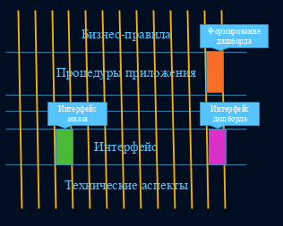

#### 16. Режимы разделения приложения.

Существует много разных способов деления на уровни и варианты использования. Деление можно выполнить на уровне исходного кода, на уровне двоичного кода (развертывания) и на уровне единиц выполнения (служб).

- **Уровень исходного кода.** Мы можем так настроить зависимости между модулями с исходным кодом, чтобы изменения в одном модуле не вынуждали производить изменения в других (например, Ruby Gems).

При использовании этого режима разделения все компоненты выполняются в общем адресном пространстве и взаимодействуют, просто вызывая функции друг друга. То есть имеется единственный выполняемый файл, загружаемый в память компьютера. Люди часто называют это монолитной структурой.

- **Уровень развертывания.** Мы можем так настроить зависимости между единицами развертывания, jar-файлами или динамически загружаемыми библиотеками, чтобы изменения в исходном коде в одном модуле не вынуждали производить повторную сборку и развертывание других.

Многие компоненты могут находиться в общем адресном пространстве и взаимодействовать, вызывая функции друг друга. Другие компоненты могут выполняться в других процессах на той же машине и взаимодействовать посредством механизмов межпроцессных взаимодействий, сокетов или разделяемой памяти. Важно отметить, что в этом случае разделенные компоненты находятся в независимых единицах развертывания, таких как jar-, gem-файлы или динамически загружаемые библиотеки.

- **Уровень служб.** Мы можем ограничить зависимости до уровня структур данных и взаимодействовать, обмениваясь исключительно сетевыми пакетами, чтобы каждая единица выполнения была по-настоящему независимой от изменений в исходном и двоичном коде в других (как, например, службы и микрослужбы).

Роберт Мартин:

Я предпочитаю доводить деление до того состояния, когда при необходимости легко можно сформировать отдельные службы, но оставлять компоненты в общем адресном пространстве до тех пор, пока это возможно. Это оставляет открытой возможность организации служб.

При таком подходе компоненты первоначально разделяются на уровне исходного кода. Этого может оказаться достаточно для продолжительного развития проекта. Если возникают проблемы с развертыванием или разработкой, разделения до уровня развертывания может быть достаточно — по крайней мере на какое-то время.

Хорошая архитектура позволит создать монолитную систему, развертываемую как один файл, а затем превратить ее в набор независимых единиц развертывания и далее в независимые службы и/или микрослужбы. Позднее, когда что-то изменится, она должна позволить обратить все вспять и вновь вернуться к монолитной структуре.

Хорошая архитектура защищает большую часть исходного кода от таких изменений. Она оставляет режим разделения открытым, поэтому для крупномасштабных вариантов развертывания может использоваться один режим, а для мелкомасштабных — другой.

#### 17. Границы. Пересечение границ.

Разработка архитектуры программного обеспечения — это искусство проведения разделяющих линий, границ. Границы отделяют программные элементы друг от друга и избавляют их от необходимости знать, что находится по ту сторону.

Отделять линиями нужно все, что не имеет значения. Графический интерфейс не имеет значения для бизнес-правил, поэтому между ними нужно провести границу. База данных не имеет значения для графического интерфейса, поэтому между ними нужно провести границу. База данных не имеет значения для бизнес-правил, поэтому между ними нужно провести границу.

Прежде чем провести линии границ в архитектуре программного обеспечения, систему нужно разделить на компоненты. Некоторые из этих компонентов реализуют основные бизнес-правила; другие являются плагинами, содержащими функции, которые не имеют прямой связи с бизнес-правилами. Затем можно организовать код в компонентах так, чтобы стрелки между ними указывали в одном направлении — в сторону бизнес-правил.

Пересечение границы во время выполнения — это не что иное, как вызов функции из другой функции, находящейся по другую сторону границы и передающей некоторые данные. Вся хитрость создания подобающих пересечений границ заключается в управлении зависимостями на уровне исходного кода.

Простейшим пересечением границы является вызов низкоуровневым клиентом функции в высокоуровневой службе. Обе зависимости — времени выполнения и времени компиляции — указывают в одном направлении, в сторону высокоуровневого компонента.

Термин «уровень» имеет строгое определение: «удаленность от ввода и вывода». Чем дальше политика от ввода и вывода, тем выше ее уровень. Политики, управляющие вводом и выводом, являются самыми низкоуровневыми в системе.


Диаграмма потоков данных на рис. соответствует простой программе шифрования, которая читает символы из устройства ввода, преобразует их с использованием таблицы и записывает преобразованные символы в устройство вывода. Направления потоков данных показаны на диаграмме извилистыми сплошными стрелками. Правильно спроектированные зависимости в исходном коде показаны пунктирными стрелками.

Компонент, выполняющий преобразование, — это самый высокоуровневый компонент в данной системе, потому что он дальше других находится от ввода и вывода.

Обратите внимание, что потоки данных и зависимости в исходном коде не всегда указывают в одном направлении. Это тоже один из элементов искусства создания программных архитектур. Мы должны отделить зависимости в исходном коде от потоков данных и связать с уровнем.

Мы легко могли бы создать неправильную архитектуру, реализовав программу так:

    function encrypt() {
      while(true)
        writeChar(translate(readChar()));
    }

Это неправильная архитектура, потому что высокоуровневая функция encrypt зависит от низкоуровневых функций readChar и writeChar.

Более удачная архитектура для этой системы:


Обратите внимание на пунктирную границу, окружающую класс Encrypt, и интерфейсы CharWriter и CharReader. Все зависимости, пересекающие границу, указывают внутрь. Этот модуль является элементом высшего уровня в системе.

На диаграмме также изображены классы ConsoleReader и ConsoleWriter. Они находятся на более низком уровне, потому что расположены ближе к вводу и выводу.

Обратите внимание, как эта структура отделяет высокоуровневую политику шифрования от низкоуровневых политик ввода/вывода. Это позволяет использовать политику шифрования в широком диапазоне контекстов. Когда в политиках ввода и вывода происходят изменения, они никак не затрагивают политику шифрования.

Помните, что политики группируются в компоненты по способам изменения. Политики, изменяющиеся по одним причинам и в одно время, объединяются в соответствии с принципами единственной ответственности (SRP) и согласованного изменения (CCP). Чем дальше политика от ввода и вывода, тем выше ее уровень и тем реже она изменяется и по более важным причинам. Чем ближе политика к вводу и выводу, тем ниже ее уровень и тем чаще она изменяется и по более неотложным, но менее важным причинам.

#### 18. Большой Комок Грязи и концептуальные недостатки фреймворков.

**БОЛЬШОЙ КОМОК ГРЯЗИ** - беспорядочный, сырой, словно перемотанный на скорую руку изоляционной лентой и проводами, запутавшийся в джунглях спагетти-код. Мы все видели такой код. В этих системах легко найти признаки нерегулируемого роста и постоянных доделок. Информация распространяется без разбора между отдаленными элементами системы, при этом зачастую вся важная информация становится глобальной или дублируется. Структура системы в целом никогда не было точно определена. Если и была, то ее разрушили до такой степени, что оригинал уже не узнать. Программисты хоть немного понимающие архитектуру, обходят это болото стороной. И только те, кого она волнует мало и, возможно, те, кому нравится латать дыры в системе каждый день, довольны работой таких систем.

Почему система превращается в БОЛЬШОЙ КОМОК ГРЯЗИ? Иногда большие и страшные системы появляются из-за создания разового кода. **Разовый код** – это быстрый, черновой вариант кода, который должен был использоваться только один раз, а затем выброшен. Однако иногда такой код начинает жить собственной жизнью, несмотря на свою не проработанную структуру и плохо разработанную документацию или ее отсутствие. Он работает, зачем что-то чинить? Когда возникает какая-то проблема, то самый быстрый способ решить ее — изменить работающий код. Это избавляет от необходимости создавать программу с нуля, но со временем, простые разовые программы порождают БОЛЬШОЙ КОМОК ГРЯЗИ.

Даже системы с хорошо прописанной архитектурой рискуют пострадать от распада структуры. Любая успешная система находится под огнём постоянно изменяющихся требований, что постепенно подрывает ее структуру. Некогда чистые системы зарастают из-за поэтапного роста структуры, и элементы системы начинают разрастаться бесконтрольно.
Если не прекратить этот рост, то структура системы нарушается до такой степени, что от нее нужно отказываться.

Так как понимание системы становится все труднее, ее поддержка становится сложнее и обходится все дороже. Хорошие программисты отказываются работать с такой структурой. Один из способов остановить энтропию в ПО — перепроектирование (рефракторинг). Приверженность периодическому рефакторингу может защитить систему от сползания в БОЛЬШОЙ КОМОК ГРЯЗИ. В более серьезных случаях, трудно найти альтернативу, поэтому все сносят и начинают строительство заново.

**Концептуальные недостатки фреймворков**

1. Прежде чем воспользоваться всеми прелестями фреймворка вы должны потратить своё время на то, чтобы узнать, как использовать его.

2. Если задуматься, то термин «готовые к использованию» подразумевает под собой «одно решение для всех», когда фреймворк пытается решить проблемы всех пользователей для каждой ситуации, может случиться так, что разработчик столкнётся с огромным количеством ненужного ему кода.

3. Так как готовые решения сделаны для массового потребителя, вы можете быть почти уверены в том, что вам придётся что-то настраивать под себя для удовлетворения потребностей вашего проекта, что занимает дополнительное время.

4. Во многих случаях, фреймворки не могут покрыть все потребности разработчика, что приводит к дополнительной интеграции сторонних компонентов (например, в виде раздутых плагинов JQuery и т.п.).

5. Практически, вы не имеете никакого контроля над кодом. При этом, если команда разработчиков решит удалить какой-то компонент фреймворка, то вы будете вынуждены признать это изменение. Иначе, если вы не хотите соглашаться с их мнением, придётся модифицировать фреймворк или использовать старую версию их продукта.

Многие фреймворки были созданы для определенных задач и целей, исходя из этого можем сделать вывод, что использование фреймворка это не панацея.
Плохих и хороших фреймворков нет. Для каждой отдельной задачи подходит свое решение и свой фреймворк.

#### 19. Трёхслойная архитектура М.Фаулера.

Фаулер и руководство компании Microsoft по проектированию архитектуры приложений выделяют три слоя абстракции, на которые можно разделить разрабатываемое приложение.


**Первый слой абстракции** — это слой доступа к данным. В задачи данного слоя входит абстрагирование от базы данных. SQL-запросы к базе данных, в которой и хранятся данные приложения, скрываются за фасадом, который использует бизнес-слой.

**Второй слой абстракции** — это слой бизнес-логики. Он содержит объекты предметной области, а также функции для работы с ними. Эти функции и реализуют данную бизнес-логику.

**Третий слой абстракции** — это слой взаимодействия с пользователем. Данный слой включает компоненты пользовательского интерфейса.

**Преимущества**:

1. Подход делает возможным параллельную разработку и тестирование каждого из слоев
2. Позволяет изменять структуру или полностью заменять один из слоев не изменяя другие

**Главный недостаток**:

1. Зависимость бизнес-логики от системы хранения

#### 20. Чистая архитектура Р.Мартина.

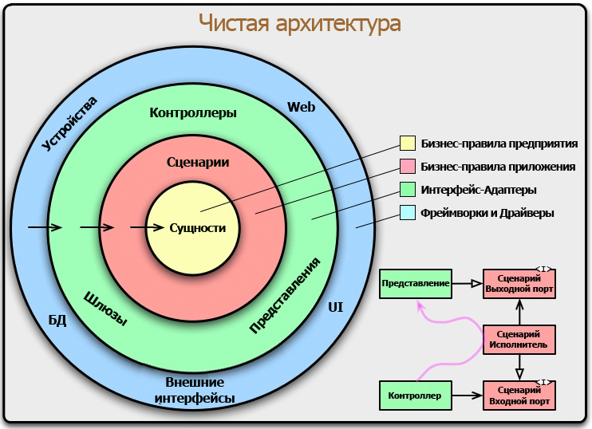

Clean Architecture объединила в себе идеи нескольких других архитектурных подходов, которые сходятся в том, что архитектура должна:

- быть тестируемой;
- не зависеть от UI;
- не зависеть от БД, внешних фреймворков и библиотек.

Это достигается разделением на слои и следованием Dependency Rule (правилу зависимостей).

**Dependency Rule говорит, что внутренние слои не должны зависеть от внешних.** То есть наша бизнес-логика и логика приложения не должны зависеть от презентеров, UI, баз данных и т.п. На оригинальной схеме это правило изображено стрелками, указывающими внутрь.

_Имена сущностей (классов, функций, переменных, чего угодно), объявленных во внешних слоях, не должны встречаться в коде внутренних слоев._

Это правило позволяет строить системы, которые будет проще поддерживать, потому что изменения во внешних слоях не затронут внутренние слои.

Выделяют 4 слоя:
- **Entities.** Бизнес-логика общая для многих приложений.
- **Use Cases (Interactors).** Логика приложения.
- **Interface Adapters.** Адаптеры между Use Cases и внешним миром. Сюда попадают Presenter’ы из MVP, а также Gateways (репозитории). Преобразовывают данные от use case в формат для внешних агентов и систем хранения (БД, веб, GUI)
- **Frameworks.** Самый внешний слой, тут лежит все остальное: UI, база данных, http-клиент, и т.п.

**Переходы между слоями осуществляются через Boundaries**, то есть через два интерфейса: один для запроса и один для ответа. Они нужны, чтобы внутренний слой не зависел от внешнего (следуя Dependency Rule), но при этом мог передать ему данные.

Через границы данные передаются в скалярном виде или простейшими структурами и объектами – Data Transfer Objects (DTO).

#### 21. Порты и Адаптеры А.Кокберна. Уровни гексагональной архитектуры.

*Презентация ПРиС 05, слайды 9-11; метода к 4-ой лабе*

**Гексагональная архитектура (Порты и Адаптеры)**

Гексагональная архитектура (в отличие от трехслойной) – симметрично трактует внешние связи. Вместо уровня представления – входящие адаптеры, вместо систем хранения – исходящие адаптеры.

В центре – бизнес-логика, которая не зависит от адаптеров. У бизнес-логики есть порты, определяющие как взаимодействовать с внешним кодом (интерфейсы).

Адаптеры реализуют порты.

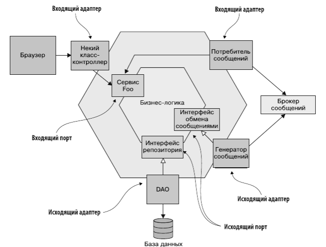

**Уровни гексагональной архитектуры**

* Бизнес-логика реализуется уровнями домена (критические бизнес-правила) и приложения (варианты использования)
* Инфраструктура содержит адаптеры для взаимодействия с внешним миром
* Dependency Rule: все зависимости только внутрь

+: Независимость разработки домена от деталей, тестируемость бизнес-логики

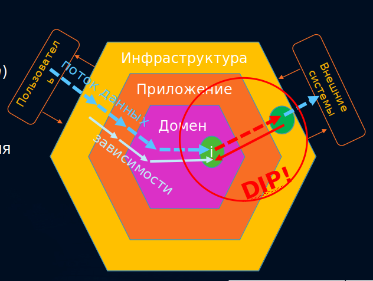

Пример:

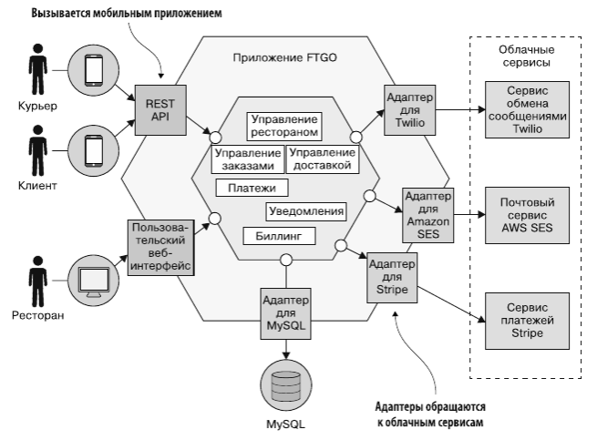

Микросервисная архитектура - соединенные между собой шестиугольники.

*Вон Вернон. Реализация методов предметно-ориентированного проектирования. Стр. 183-187*

**ГЕКСАГОНАЛЬНОЙ АРХИТЕКТУРОЙ (или Порты и Адаптеры)** Элистер Кокберн назвал стиль, предназначенный для создания симметрии. Она достигает этой цели, разрешая множеству разнообразных клиентов взаимодействовать с системой на равной основе. Нужен новый клиент? Не проблема. Просто добавьте АДАПТЕР для преобразования любой входной информации клиента в данные, понятные для внутреннего интерфейса прикладного программирования. В то же время механизмы вывода, развернутые в системе, такие как средства графической визуализации, постоянного хранения данных и передачи сообщений, могут быть разнообразными и взаимозаменяемыми. Это возможно благодаря АДАПТЕРУ, созданному для преобразования результатов работы приложения в форму, приемлемую для конкретного механизма вывода.

Обычно место, в котором клиенты взаимодействуют с системой, называют "внешним интерфейсом" ("front end"). Аналогично место, откуда приложение извлекает постоянно хранящиеся данные, где оно сохраняет постоянно хранящиеся данные или пересылает выходную информацию, называется "внутренним интерфейсом" ("bасk end"). Однако гексагональная архитектура вводит другую классификацию частей системы, как показано на рис. 4.4. Существуют две основные области внешняя и внутренняя. Внешняя область позволяет разнообразным клиентам вводить данные и предоставляет механизмы для извлечения постоянно хранящихся данных, сохранять результаты работы приложения (например, в базе данных) или посылать их куда-нибудь (например, посылать сообщения).

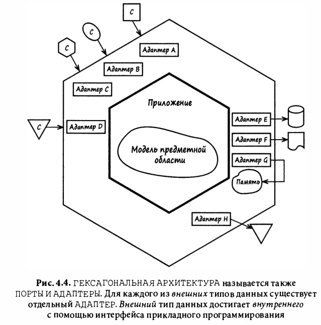

Строгого определения, что такое ПОРТ, не существует и это обеспечивает гибкость концепции. Независимо от разновидности ПОРТА, на него поступают запросы клиента, а АДАПТЕР преобразовывает их входную информацию. Затем он вызывает операцию приложения или посылает приложению событие. Тем самым управление передается во внутреннюю часть системы.

Приложение получает запросы с помощью своего открытого интерфейса API. Границы приложения, или внутренний шестиугольник, также представляют собой границу сценария использования (или пользовательские истории). Иначе говоря, мы должны создавать сценарии использования, основываясь на функциональных требованиях приложения, а не на требованиях многочисленных и разнообразных клиентов или механизмов вывода. Когда приложение получает запрос через свой интерфейс API, оно использует модель предметной области для выполнения всех запросов, связанных с реализацией бизнес-логики. Таким образом, интерфейс API приложения публикуется как множество СЛУЖБ ПРИЛОЖЕНИЯ.

Большое преимущество ГЕКСАГОНАЛЬНОЙ АРХИТЕКТУРЫ заключается в том, что АДАПТЕРЫ легко поддаются тестированию. Все приложение и модель предметной области можно разрабатывать и тестировать до того, как появятся клиенты и механизмы хранения данных, до принятия каких-либо решений о поддержке протоколов HTTP/REST, SOAP или ПОРТОВ, рассылающих сообщения. Любое количество тестовых клиентов можно создать еще до того, как будет завершен макет пользовательского интерфейса. Задолго до того как будет выбран механизм постоянного хранения данных, в памяти можно развернуть ХРАНИЛИЩА для имитации постоянного хранения во время тестирования. Так, можно достичь значительного прогресса в разработке ядра независимо от вспомогательных технических компонентов.

При правильном проектировании внутренний шестиугольник - приложение и модель предметной области - никак не повлияет на внешние части. Это создаст четкие границы, внутри которых будет реализован каждый сценарий использования. Помимо произвольного количества клиентов, АДАПТЕР может поддерживать многочисленные автоматизированные тесты и реальные клиенты, а также механизмы хранения, рассылки сообщений и другие средства вывода.

#### 22. Правило зависимостей и инверсия зависимостей в гексагональной архитектуре.

В рамках гексагональной архитектуры мы придерживаемся одностороннего потока зависимостей: снаружи внутрь. Слой предметной области (центральный слой) не должен зависеть от наружных слоев.
 
Зависимости проще представить когда мы прокидываем данные/логику “внутрь”. Когда на сервер приходит HTTP запрос, у нас должен быть какой-то код, который обработает его, иначе ничего не произойдет. Следовательно, внешний HTTP запрос зависит от нашего слоя фреймворка, который нужен для интерпретации запроса. Если фреймворку удалось интерпретировать запрос и определить маршрут к контроллеру, которому он соответствует, то этому контроллеру нужно что-то чтобы выполнить действия. Без слоя уровня приложения ему нечего делать. Слой уровня фреймворка зависит от слоя уровня приложения. Чтобы слою уровня приложения было кем руководить, ему нужен слой предметной области. Он зависит от него для того, чтобы иметь возможность выполнить требуемое действие.

Когда мы выходим наружу, все становится чуточку сложнее. Нашему слою предметной области скорее всего нужен будет доступ к базе данных, чтобы загрузить оттуда сущности. Следовательно слой предметной области зависит от какого-то хранилища данных. Слой уровня приложения после завершения какой-то задачи должен отправить уведомление пользователю. Если мы используем email-ы для доставки уведомлений, и при этом для используем AWS SES, то мы можем сказать, что наш слой уровня приложения имеет зависимость от SES для организации доставки уведомлений. Поможет нам принцип SOLID Инвертирование зависимостей. Воспользуемся интерфейсами для инверсии зависимостей. С их помощью мы можем регламентировать, как будут взаимодействовать наши слои. Причем нам совсем не интересно как будут реализованы эти интерфейсы в других слоях. Таким образом конкретный слой диктует внешним слоям что он от них хочет, не завися от реализации. Это и есть инверсия зависимостей.

#### 23. Типовые решения организации бизнес-логики: сценарий транзакции.

Сценарий транзакций организует логику вычислительного процесса преимущественно в виде единой процедуры, которая обращается к базе данных напрямую или при посредничестве кода тонкой оболочки. Каждой транзакции ставится в соответствие собственный сценарий транзакций (общие подзадачи могут быть вынесены в подчинённые процедуры).

При использовании типового решения сценарий транзакции логика предметной области распределяется по транзакциям, выполняемым в системе. Если, например, пользователю необходимо заказать номер в гостинице, соответствующая процедура должна предусматривать действия по проверке наличия подходящего номера, вычислению суммы оплаты и фиксации заказа в базе данных.

Простые случаи не требуют особых объяснений. Разумеется, как и при написании иных программ, структурировать код по модулям следует осмысленно. Это не должно вызвать затруднений, если только транзакция не оказывается слишком сложной. Одно из основных преимуществ сценария транзакций заключается в том, что не приходится беспокоиться о наличии и вариантах функционирования других параллельных транзакций. Задача – получить входную информацию, опросить базу данных, сделать выводы и сохранить результаты.

Где расположить сценарий транзакций, зависит от организации слоёв системы. Этим местом может быть страница сервера, сценарий CGI или объект распределённого сеанса. Предпочтительнее обособлять сценарии транзакций настолько строго, насколько это возможно. В самом крайнем случае можно размещать их в различных подпрограммах, а лучше – в классах, отличных от тех, которые относятся к слоям представления и источника данных. Помимо того, следует избегать вызовов, направленных из сценариев транзакций к коду логики представления; это облегчит тестирование сценариев транзакций и их возможную модификацию.

Существует два способа разнесения кода сценариев транзакций по классам. Наиболее общий, прямолинейный и удобный во многих ситуациях – использование одного класса для реализации нескольких сценариев транзакций. Второй, связан с разработкой собственного класса для каждого сценария транзакций: определяется тип, базовый по отношению ко всем командам, в котором предусматривается некий метод выполнения, удовлетворяющий логике сценария транзакций. Преимущества каждого подхода – возможность манипулировать экземплярами сценариев как объектами в период выполнения, хотя в системах, где бизнес-логика организована с помощью сценариев транзакций, подобная потребность возникает сравнительно редко. Разумеется, во многих языках модель классов можно полностью игнорировать, полагаясь, скажем, только на глобальные функции. Однако вполне очевидно, что аппарат создания объектов помогает преодолевать проблемы потоков вычислений и облегчает изоляцию данных.

Плюсы:
- удобная процедурная модель;
- всем понятно;
- определяет границы транзакции;
- всё в одном.

Минусы:
- слишком «всё в одном»;
- повторение, дублирование кода;
- приложение без отчетливой структуры;
- нормально только при небольшой сложности бизнес-логики.

#### 24. Типовые решения организации бизнес-логики: модель предметной области.

Модель предметной области - это объектная модель домена, охватывающая поведение (функции) и свойства (данные).

Реализация модели предметной области означает пополнение приложения целым слоем объектов, описывающих различные стороны определённой области бизнеса. Одни объекты призваны имитировать элементы данных, которыми оперируют в этой области, а другие должны формализовать те или иные бизнес-правила. Функции тесно сочетаются с данными, которыми они манипулируют.

Объектно-ориентированная модель предметной области часто напоминает схему соответствующей базы данных, хотя между ними всё ещё остаётся множество различий. В модели предметной области смешиваются данные и функции, допускаются многозначные атрибуты, создаются сложные сети ассоциаций и используются связи наследования.

В сфере корпоративных программных приложений можно выделить две разновидности модели предметной области. «Простая» во многом походит на схему базы данных и содержит, как правило, по одному объекту домена в расчёте на каждую таблицу. "Сложная" модель может отличаться от структуры базы данных и содержать иерархии наследования, а так же сложные сети мелких взаимосвязанных объектов. Сложная модель более адекватно представляет запутанную бизнес-логику, но труднее поддаётся отображению в реляционную схему базы данных.

Бизнес-логика обычно подвержена частым изменениям, поэтому весьма важна возможность простой модификации и тестирования этого слоя кода. Отсюда следует настоятельная необходимость снижать степень зависимости модели предметной области от других слоёв системы.

Плюсы:
- «True» ОО подходы;
- отделение политики от деталей;
- независимость разработки, тестирования;
- повторное использование кода;
- удобный рефакторинг.

Минусы:
- высокий порог вхождения;
- высокая стоимость разработки.

#### 25. Типовые решения организации бизнес-логики: модуль таблицы.

Модуль таблицы - это объект, охватывающий логику обработки всех записей хранимой или виртуальной таблицы базы данных.

Типовое решение модуль таблицы предусматривает создание по одному классу на каждую таблицу базы данных, и единственный экзем-пляр класса содержит всю логику обработки данных таблицы. Основное отличие модуля таблицы от модели предметной области состоит в том, что если, например, приложение обслуживает множество заказчиков, в соответствии с моделью предметной области придется скон-струировать по одному объекту на каждый заказ, а при использова-нии модуля таблицы понадобится всего один объект, представляющий одновременно все заказы.

Плюсы:
- структурированнее, чем сценарий транзакции.

Минусы:
- недо-ООП;
- невозможность использовать соответствующие подходы.

#### 26. Слой служб.

Слой служб - промежуточное звено между логикой предметной области и внешним представлением системы.

В слой служб входят:
1. Use Cases - слой служб, содержащий API, ориентированный на варианты использования, логику управления транзакциями, средства обеспечения безопасности
 приложение: транзакции, use case API домена.
 домен: модель предметной области или сценарий транзакции.
2. Сценарии транзакции – бизнес-логика вынесена на слой служб 
   приложение: СТ каждого use case
   домен: анемичные модели, Active Record
3. Контроллер-сущность – логика распределена между СТ на слое служб (use case контроллерами) и сущностями домена
   приложение: СТ каждого use case
   домен: МПО
   
#### 27. Предметно-ориентированное проектирование. Определение, цели, задачи.

*Презентация ПРиС 07, слайды 3-6*

**Предметно-ориентированное проектирование (Domain-Driven Design)** – это набор принципов и схем, направленных на создание оптимальных систем объектов.  
  
Сводится к созданию программных абстракций, которые называются моделями предметных областей.
  
В эти модели входит бизнес-логика, устанавливающая связь между реальными условиями области применения продукта и кодом.


**Цель DDD:**
 
***Моделировать сложную предметную область так, чтобы программная реализация была простой,***  

Если приложение будет значительно расти и усложняться
  
Если предметная область сложна и/или незнакома
  
**НО НЕ**
  
***Добавить сложности к простой предметной области***

Если приложение – набор CRUD-операций
  
Если меньше 30 вариантов использования
  
***В этом случае DDD не нужен, вреден – подумайте о фреймворке***

**Проблемы, которых можно избежать**

* С т.з. бизнеса – разработка ПО является статьей расходов, а не источником прибыли
* Разработчики слишком много внимания уделяют новым технологиям, но не хорошему дизайну
* Слишком высокий приоритет БД
* Наименования объектов и операций в ПО не совпадает с бизнес-целями и запросами (плохое сотрудничество с экспертами)
* Вместо дизайна – перетасовывание задач на доске (в бэклоге)
* Бизнес-логика смешивается с UI и СХД
* Неверные абстракции, сильно связанные службы, блокировки БД, ...

**Побочный эффект** - (скорее нет?)

**DDD основано на:**
- **Стратегическое проектирование** - моделирование предметной области, с разбиением на подобласти, с точки зрения бизнеса, но не технических аспектов,
позволяет поднять уровень знаний (в предметной области) разработчиков и значительно упростить последующую реализацию.
- **Тактическое проектирование** - применение паттернов и инструментальных средств для моделирования конкретных объектов и их взаимосвязей в рамках
подобластей предметной области.

[Wiki](https://ru.wikipedia.org/wiki/Предметно-ориентированное_проектирование)

**Предметно-ориентированное проектирование** - это набор принципов и схем, направленных на создание оптимальных систем объектов. Сводится к созданию программных абстракций, которые называются моделями предметных областей. В эти модели входит бизнес-логика, устанавливающая связь между реальными условиями области применения продукта и кодом.

Предметно-ориентированное проектирование не является какой-либо конкретной технологией или методологией. DDD — это набор правил, которые позволяют принимать правильные проектные решения. Данный подход позволяет значительно ускорить процесс проектирования программного обеспечения в незнакомой предметной области.

Подход DDD особо полезен в ситуациях, когда разработчик не является специалистом в области разрабатываемого продукта. К примеру: программист не может знать все области, в которых требуется создать ПО, но с помощью правильного представления структуры, посредством предметно-ориентированного подхода, может без труда спроектировать приложение, основываясь на ключевых моментах и знаниях рабочей области.

Данный термин был впервые введен Э. Эвансом в его книге с таким же названием «Domain-Driven Design». 

https://medium.com/daily-coding/p-fb4441d5179c

Плюсы DDD:
* почти все участники команды могут читать код проекта;
* постановка задач становится более явной;
* баги бизнес логики становиться проще искать;
* QA специалистам намного легче просматривать код и находить логические ошибки и баги.

Минусы DDD:
* требуется высокая квалификация разработчиков, особенно, на старте проекта;
* не все клиенты готовы пойти на такие затраты, DDD нужно учиться всем участникам процесса разработки.

#### 28. Стратегическое проектирование DDD. Концепции.

Domain-Driven Design (Предметно-ориентированное проектирование) - это набор принципов и схем, направленных на создание оптимальных систем объектов.

DDD сводится к созданию программных абстракций, которые называются моделями предметных областей.
В эти модели входит бизнес-логика, устанавливающая связь между реальными условиями области применения продукта и кодом.
Предметно-ориентированное проектирование не является какой-либо конкретной технологией или методологией. DDD — это набор правил, которые позволяют принимать правильные проектные решения. Данный подход позволяет значительно ускорить процесс проектирования программного обеспечения в незнакомой предметной области.

Основная цель DDD: моделировать сложную предметную область так, чтобы программная реализация была простой в случае если:
- Если приложение будет значительно расти и усложняться
- Если предметная область сложна и/или незнакома

DDD основано на:
- Стратегическое проектирование - моделирование предметной области, с разбиением на подобласти, с точки зрения бизнеса, но не технических аспектов,
позволяет поднять уровень знаний (в предметной области) разработчиков и значительно упростить последующую реализацию.
- Тактическое проектирование - применение паттернов и инструментальных средств для моделирования конкретных объектов и их взаимосвязей в рамках
подобластей предметной области.

Концепции DDD:
- Эксперты предметной области - люди, полностью понимающие предметную область бизнеса, для которого строится приложени.
- Модель предметной области - объектная модель предметной области, включающая в себя как поведение, так и данные.
- Подобласти - часть предметной области, отдельная логическая модель некоторой предметной области.
- Единый язык - модель, именованная в терминах предметной области, в четко определенном ограниченном контексте.
- Ограниченный контекст - семантическая контекстная граница; область, в которой реализуется модель.
- Смысловое ядро - ограниченный контекст, который разрабатывается как ключевая стратегическая инциатива; самая важная модель, приносящая конкурентное преимущество.
- Связывание контекстов - это взаимодействие смыслового ядра с другими ограниченными контекстами, любых ограниченных контекстов между собой.
- Карты контекстов - совокупность ограниченных контекстов, а также интеграционных связей между ними.

#### 29. Единый язык и ограниченные контексты.

Единый язык - модель (понятия, объекты, взаимосвязи, процессы), именованная в терминах предметной области, в четко определенном ограниченном контексте.
Это один из основных и самых важных шаблонов предметного-ориентированного проектирования. Это настоящий язык, созданный целостной командой – экспертами в предметной области, разработчиками, бизнес-аналитиками и всеми, кто вовлечен в создание системы. Роль в команде не столь существенна, поскольку каждый член команды использует для описания проекта единый язык. Процесс создания единого языка более творческий чем формальный, так как он, как и любой другой естественный язык, постоянно развивается, а те артефакты, которые вначале способствовали разработке полезного единого языка, со временем устаревают. В итоге, остаются только самые устойчивые и проверенные элементы.
Порой, в нашей профессии, сформулировать требование к продукту бывает сложнее, чем реализовать его. Разные предметные области сложны по своему. Разрабатывая приложения для банка, трейдинга и др. можно столкнутся с кучей непонятных понятий. 
Единый язык — это базовая концепция борьбы со сложностью. Если предметная область итак требует изучения, то не стоит делать вещи еще сложнее и заставлять людей разбираться еще и в вашей модели предметной области. Стоит называть вещи одинаково как в спецификации, так и в коде.

Ограниченный контекст – семантическая контекстная граница; область, в которой реализуется модель. Очень важно понимать, что в рамках предметной области смысл определенного термина или фразы может сильно отличаться. Ограниченный контекст - граница, в пределах которой понятия единого языка имеют вполне конкретное контекстное значение.
В каждом ограниченном контексте существует только один единый язык.
- Ограниченные контексты являются относительно небольшими, меньше чем может показаться на первый взгляд. 
- Ограниченный контекст достаточно велик только для единого языка изолированной предметной области, но не больше.
- Единый значит «вездесущий» или «повсеместный», т. е. язык, на котором говорят члены команды и на котором выражается отдельная модель предметной области, которую разрабатывает команда. 
- Язык является единым только в рамках команды, работающей над проектом в едином ограниченном контексте.
- Попытка применить единый язык в рамках всего предприятия или что хуже, среди нескольких предприятий, закончится провалом.

#### 30. Подобласти. Смысловое ядро.

Подобласть - часть предметной области, отдельная логическая модель некоторой предметной области. Подобласти позволяют быстрее определить разные части предметной области, необходимые для решения конкретной задачи.

Подобласти делятся на 3 типа:
- Смысловое ядро - это подобласть, имеющая первостепенное значение для организации. Со стратегической точки зрения бизнес должен выделяться своим смысловым ядром. Большинство DDD проектов сосредоточены именно на смысловом ядре. Лучшие разработчики и эксперты должны быть задействованы именно в этой подобласти. Большинство инвестиций должны быть направлены именно сюда для достижения преимущества для бизнеса и получения наибольшей прибыли. Эта задача имеет очень высокий приоритет для организации, потому что именно ее решение дает конкурентное преимущество.
- Вспомогательная подобласть - такая подобласть требует специального моделирования ситуаций, для которых не существует готовых решений. Однако такие подобласти не требуют настолько больших инвестиций, как смысловое ядро. Разработку таких ограниченных контекстов можно поручить сторонним организациям, чтобы не перепутать их с областями стратегического назначения и не вложить в них слишком большие средства. Эта подобласть не является самой важной, может быть реализована позже. И все же это важные программные модели, потому что смысловое ядро не может успешно работать без них. 
- Универсальная подобласть -  Этот вид решения можно приобрести готовым, но можно также привлечь к его разработке сторонние организации или даже отдельное подразделение вашей организации, в которую не входят элитные разработчики, которые в основном должны заниматься смысловым ядром и в меньшей степени вспомогательными подобластями. Опасайтесь принять универсальную подобласть за смысловое ядро. Не надо вкладывать в нее крупные инвестиции.

#### 31. Способы связывания контекстов: общее ядро, партнёрство, клиент-поставщик.

>todo

#### 32. Способы связывания контекстов: конформист, предохранительный уровень, службы с открытым протоколом.

>todo

#### 33. Способы связывания контекстов: общедоступный язык, отдельное существование.

>todo

#### 34. Технологические нюансы связывания контекстов.

>todo

#### 35. Сущность. Объект значений. Фабрика.

**Сущность** — объект, обладающий устойчивой идентичностью. Две сущности, чьи атрибуты имеют одинаковые значения, — это все равно разные объекты.

**Объект значений** — объект, представляющий собой набор значений. Два объекта значений с одинаковыми атрибутами взаимозаменяемы. Примером таких объектов может служить класс Money, который состоит из валюты и суммы.

**Фабрика** — объект или метод, реализующий логику создания объектов, которую ввиду ее сложности не следует размещать прямо в конструкторе. Фабрика также может скрывать конкретные классы, экземпляры которых создает. Она реализуется в виде статического метода или класса.

#### 36. Сервисы доменные, прикладные, инфраструктурные.

**Сервисы приложения** оперируют скалярными типами, трансформируя их в типы предметной области. Скалярными являются любые типы, неизвестные Доменной модели. Сюда включаются примитивные типы, и типы, не относящиеся к домену.

**Доменные сервисы** оперируют только типами, принадлежащими домену. Они содержат значимые концепции, которые могут быть найдены в Едином языке. Реализуют операции, которые недостаточно хорошо подходят сущностям или объектам значений.

**Инфраструктурные сервисы** реализуют все операции, которые касаются инфраструктуры, такие как отправка почты или журналирование значимых данных. В терминах гексагональной архитектуры, они лежат вне границ домена.

#### 37. Агрегат. Генерация идентичности. Репозиторий.

**Агрегат** — это кластер доменных объектов, с которыми можно обращаться как с единым целым. Он состоит из корневой сущности и иногда одной или нескольких сущностей и объектов значений.

Агрегаты разбивают доменную модель на блоки, в которых легче разобраться по отдельности. Они также проясняют область применения операций, таких как загрузка, обновление и удаление. Эти операции распространяются на весь агрегат, а не на какие-то его части.

В классических подходах для **генерации идентификатора сущностей** часто полагаются на механизм хранения – базу данных. Например, на поле с атрибутом `AUTO_INCREMENT` в БД MySQL.

Среди других подходов можно выделить генерацию идентификатора клиентом, суррогатную идентичность и пр. Мы же будем рассматривать следующий подход: идентификатор корня агрегата генерируется приложением, реализацией специального метода репозитория. Это позволит в зависимости от реализации данного репозитория на инфраструктурном уровне релизовать как генерацию в БД MySQL, так и, например, генерацию UUID, или фейковых идентификаторов для тестирования.

Идентификатор, единожды сгенерированный, является неизменным. Для максимальной степени обеспечения данного правила идентификаторы представляются не простыми свойствами ординарного типа, которые могут быть просто изменены, а объектами значений.

**Репозиторий** — объект, предоставляющий доступ к постоянным сущностям и инкапсулирующий механизм доступа к базе данных. Репозиторий служит посредником между доменом и слоем данных используя интерфейс, схожий с коллекцией, для доступа к доменным объектам.

#### 38. Правила агрегатов. Свойства агрегатов.

Правила агрегатов:

1. **Ссылайтесь только на корень агрегата.**
Первое правило требует, чтобы корневая сущность была единственной частью агрегата, на которую могут ссылаться внешние классы. Для обновления агрегата клиенту необходимо вызвать метод из его корня. Например, сервис использует репозиторий, чтобы загрузить агрегат из базы данных и получить ссылку на его корень. С помощью метода, вызываемого из корня, он обновляет агрегат. Это правило гарантирует, что агрегат способен обеспечивать соблюдение своих инвариантов.

2. **Межагрегатные ссылки должны применять первичные ключи.**
Правило состоит в том, что агрегаты ссылаются друг на друга по уникальному значению, например по первичному ключу, а не по объектным ссылкам. Отказ от объектных ссылок в пользу уникальных идентификаторов означает, что агрегаты слабо связаны между собой. Это позволяет четко определить границы между ними и избежать случайного обновления не того агрегата. К тому же нам не нужно беспокоиться об объектных ссылках, которые выходят за пределы одного сервиса.

3. **Одна транзакция создает или обновляет один агрегат.**
Это правило идеально подходит для микросервисной архитектуры. Оно гарантирует, что транзакция не выйдет за пределы сервиса. А также хорошо согласуется с ограниченной транзакционной моделью большинства баз данных NoSQL. Это правило усложняет реализацию операций, которым нужно создавать или обновлять несколько агрегатов. Но это явно одна из тех проблем, для решения которых предназначены повествования (саги). Каждый этап повествования создает или обновляет ровно один агрегат.

Свойства агрегатов:

> Я не знаю то это или нет. Другой информации по теме я не нашёл 😔

<details>
    <summary>Один агрегат – один репозиторий</summary>
    За загрузку заказа и всех его строк отвечает репозиторий заказа.
</details>

<details>
    <summary>Чем меньше агрегат, тем удобнее работать и надежнее выполнение требований ACID-транзакционности</summary>
    В идеале одна сущность – один агрегат, а ссылки на другие сущности по id.
</details>

<details>
    <summary>Агрегаты строятся по бизнес-инвариантам</summary>
    Если есть use case, в котором нужно работать с внутренними сущностями агрегата – значит их вхождение в агрегат не является инвариантом, и они формируют отдельные агрегаты.
</details>

<details>
    <summary>Генерация идентификаторов сущностей</summary>
    Для корня агрегата – отвечает репозиторий. Для внутренних сущностей – сам агрегат.
</details>

#### 39. Доменные события. Надёжность публикации.

**Доменное событие** — это нечто произошедшее с агрегатом. В доменной модели оно имеет вид класса.

Агрегат в процессе работы (внутри транзакции) накапливает произошедшие события. В контексте DDD доменное событие — это нечто произошедшее с агрегатом. В доменной модели оно имеет вид класса. Событие обычно представляет изменение состояния. Возьмем, к примеру, агрегат Order. В число событий, которые меняют его состояние, входят Order Created, Order Cancelled, Order Shipped и т.д. При наличии заинтересованных потребителей агрегат Order может публиковать одно из этих событий в момент изменения своего состояния. 

Полезность доменных событий связана с тем, что другие стороны взаимодействия (пользователи, внешние приложения или другие компоненты внутри того же приложения) часто заинтересованы в информации об изменениях в состоянии агрегата.

Доменное событие — это класс с именем на основе страдательного причастия прошедшего времени. Он содержит свойства, которые выразительно передают это событие. Каждое свойство представляет собой либо простое значение, либо объект. Например, класс события OrderCreated содержит свойство orderId.

У доменного события обычно есть метаданные, такие как его идентификатор и временная метка. Оно может нести в себе идентификатор пользователя, который сделал изменение, поскольку это полезно для аудита. Метаданные могут быть частью объекта события — возможно, определенные в родительском классе. Или же они могут находиться внутри обертки вокруг объекта события. Идентификатор агрегата, который сгенерировал событие, тоже может быть не его непосредственным свойством, а частью обертки

**Публикация событий**

Для того, чтобы не переплетать бизнес-логику агрегата и инфраструктурную часть механики публикации событий, этот процесс ложится на плечи сервиса уровня приложения, который с использованием механизмов внедрения зависимостей (реализация DIP) фактически публикует события адаптерами инфраструктурного уровня, например, в очередь сообщений.

**Надёжность публикации событий**

Событие произошло – немедленно опубликовано 

-: транзакция может быть откачена, все изменения в агрегате отменены, а реакция на уже опубликованные события могла произойти => нарушение целостности

События накапливаются, вместе со всеми изменениями сохраняются, и при фиксации транзакции опубликовываются

+: события не будут опубликованы при откате транзакции, и не будут потеряны при отказе механизма сообщений, дополнительный лог

-: усложнение реализации

Работая с локальными транзакциями необходимо и события публиковать в рамках транзакций. Один из подходов: все события накапливаются в агрегате, а извлекаются из него и публикуются только в момент фиксации (commit) транзакции. 

Что это даёт? Если в какой-то момент что-то пошло не так, и транзакция откачена (rollback), то агрегат не изменился, и ни одно из событий, которые уже произошли в агрегате к тому моменту, не должно быть обработано другими сервисами.

Несколько вариантов реализации публикации событий:

Сага (повествование) обеспечивает согласованность данных между сервисами, используя последовательность локальных транзакций, которые координируются с помощью асинхронных сообщений.

**Хореография** — это один из способов реализации повествований.
Она не предусматривает центрального координатора, который выдает участникам команды. Вместо того участники подписываются на события друг друга и реагируют соответствующим образом.

**Порождение событий (Event Sourcing, ES)** – паттерн, согласно которому агрегат сохраняется как последовательность событий, изменяющих его состояние.

#### 40. Сага. Компенсирующие транзакции.
**Сага** представляет собой набор локальных транзакций. Каждая локальная транзакция обновляет базу данных и публикует сообщение или событие, инициируя следующую локальную транзакцию в саге. Если транзакция завершилась неудачей, например, из-за нарушения бизнес правил, тогда сага запускает компенсирующие транзакции, которые откатывают изменения, сделанные предшествующими локальными транзакциями. 

Существует два способа координации саг: 

- Хореография (Choreography) — каждая транзакция публикует события, которые запускают транзакции в других сервисах. 

- Оркестровка (Orchestration) — оркестратор говорит участникам, какие транзакции должны быть запущены. 

Сага имеет следующие преимущества 
- Позволяет приложению поддерживать согласованность данных между сервисами без использования распределенных транзакций. 

Сага имеет следующие недостатки 
- Модель программирования становится более сложной. Например, разработчики должны проектировать компенсирующие транзакции, которые отменяют изменения, сделанные ранее в саге. 

**Компенсирующая транзакция** – транзакция, отменяющая изменения с предыдущих этапов. 

Шаги в компенсирующей транзакции должны отменять действие шагов в исходной операции. Компенсирующая транзакция может оказаться неспособной просто заменить текущее состояние на состояние, в котором находилась система в начале операции, потому что при этом подходе изменения, сделанные другими параллельно запущенными экземплярами приложения, могут перезаписаться. Вместо этого необходим интеллектуальный процесс, который учитывает любую работу, выполняемую параллельно запущенными экземплярами. Этот процесс обычно будет предназначен для конкретного приложения, определяемый характером выполняемой исходной операцией. 

Общим подходом является использование рабочего процесса для реализации операции по итоговому согласованию, требующей компенсации. 

По мере выполнения исходной операции система записывает информацию о каждом шаге и о том, как можно откатить работу, выполненную на этом шаге. Если в любой момент операция завершается ошибкой, рабочий процесс поэтапно откатывается назад, выполняя работу, которая отменяет каждый шаг. Обратите внимание, что компенсирующая транзакция не обязательно должна отменять работу в точно обратном порядке по отношению к исходной операции, и, возможно, некоторые из шагов отмены можно будет выполнить параллельно. 

Компенсирующая транзакция не обязательно возвращает данные в системе в состояние, в котором они находились в начале первоначальной операции. Вместо этого она компенсирует работу, выполненную с помощью шагов, которые успешно завершились до того, как операция завершилась сбоем. 

Порядок шагов в компенсирующей транзакции не обязательно должен быть зеркальным отражением шагов в исходной операции. Например, одно хранилище данных может быть более чувствительным к несоответствиям, чем другое, и поэтому сначала необходимо выполнить шаги в компенсирующей транзакции, которая отменяет изменения в этом хранилище. 

#### 41. Хореография и оркестрация саги. 
Когда каждый сервис имеет свою собственную базу данных и бизнес-транзакция охватывает несколько сервисов, как мы обеспечиваем согласованность данных между сервисами. Каждый запрос имеет компенсационный запрос, который выполняется при сбое запроса. Это может быть реализовано двумя способами: 

**Хореография** — при отсутствии центра координации, каждый сервис создает и слушает события другого сервиса и решает, следует ли предпринять действие или нет. Хореография это способ указать, как две или более сторон; ни один из которых не имеет никакого контроля над процессами других сторон, или, возможно, какой-либо видимости этих процессов - не может координировать свои действия и процессы для обмена информацией и ценностями. Используйте хореографию, когда требуется координация между областями контроля / видимости. Вы можете думать о хореографии в простом сценарии как о сетевом протоколе. Это диктует приемлемые образцы запросов и ответов между сторонами. 

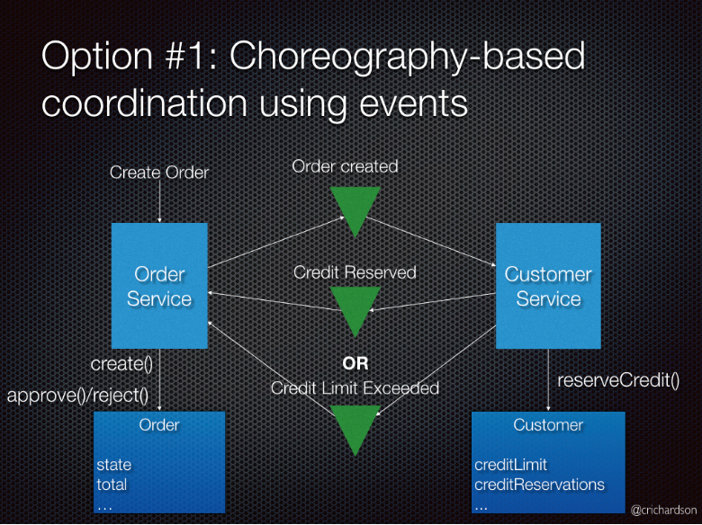 

В интернет магазине с использованием саги, основанной на хореографии, создание заказа будет включать следующие шаги: 

- Order Service (Сервис Заказа) создает Order (Заказ) в статусе pending (в ожидании) и публикует событие OrderCreated (ЗаказСоздан) 

- Customer Service (Сервис Клиента) получает событие и пытается зарезервировать кредит для заказа. После чего публикует одно из двух событий: CreditReserved (КредитЗарезервирован) или CreditLimitExceeded (КредитныйЛимитПревышен) 

- Order Service (Сервис Заказа) получает событие и изменяет состояние заказа в approved (подтвержден) или cancelled (отменен) 

Плюсы: 
- простота; 

- слабая связанность 

Минусы: 
- сложность для понимания; 

- возможны циклические зависимости 

**Оркестрация** — оркестратор (объект) берет на себя ответственность за принятие сагой решений и последовательность бизнес-логики. когда у вас есть контроль над всеми участниками процесса. когда все они находятся в одной области контроля, и вы можете контролировать поток действий. Это, конечно, чаще всего, когда вы указываете бизнес-процесс, который будет выполняться внутри одной организации, которую вы контролируете. 

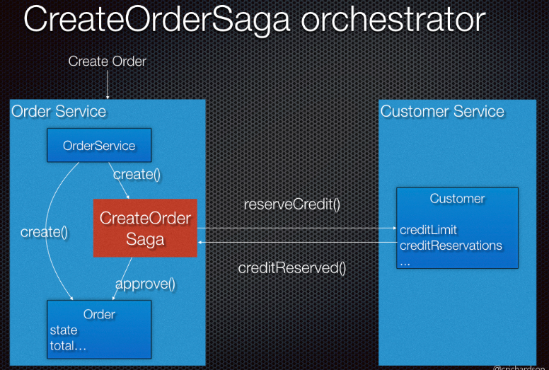 

В интернет магазине с использованием саги, основанной на оркестровке, создание заказа будет включать следующие шаги: 

- Order Service (Сервис Заказа) создает Order (Заказ) в статусе pending (в ожидании) и создает CreateOrderSaga (СагаСозданияЗаказа) 

- CreateOrderSaga (СагаСозданияЗаказа) отправляет команду ReserveCredit (ЗарезервироватьКредит) в Customer Service (Сервис Клиента) 

- Customer Service (Сервис Клиента) пытается зарезервировать кредит для заказа и отправляет назад ответ 

- CreateOrderSaga (СагаСозданияЗаказа) получает ответ и отправляет ApproveOrder (ПодтвердитьЗаказ) or RejectOrder (ОтменитьЗаказ) команду в Order Service (Сервис Заказа) 

- Order Service (Сервис Заказа) изменяет состояние заказа в approved (подтвержден) или cancelled (отменен) 

Плюсы: 
- Упрощенные зависимости; 

- меньше связывания; 

- улучшенное разделение ответственности и упрощенная бизнес-логика 

Минусы: 
- Риск избыточной централизации бизнес-логики в оркестраторе 

#### 42. Порождение событий (ES).

**Порождение событий (Event Sourcing, ES)** – паттерн, согласно которому агрегат сохраняется как последовательность событий,изменяющих его состояние.

Идея Event Sourcing в том чтобы записывать каждое событие, которое меняет состояние приложения в базу данных. Таким образом получается что мы храним не состояние наших сущностей, а все события которые к ним относятся.
В случае с Event Sourcing мы тоже оперируем с состоянием сущности. Но в отличии от обычной модели мы это состоянием не храним, а воспроизводим каждый раз при обращении.

Ключевые механизмы, которые как раз и позволяют строить разный полезный функционал следующие:
- Каждому событию дается имя, которое определяет его значение, т.е. присутствует семантика.
- Нет ограничений на кол-во событий для сущности. Соответственно новые события могут отражать, как и новые виды совершенных действий, так и расширять уже существующие, скажем, добавили новое свойство в его 2-ой версии.
- Произошедшие события неизменны («immutable»).

У Event sourcing  есть несколько преимуществ:

- Легко организовывать сбор статистики
- Хранение всей истории каждого агрегата.
- Разделение ответственности зачастую упрощает командную и запросную части приложения.

У источника событий также есть несколько недостатков:

- Поддерживать решение на Event Sourcing дорого и сложно. В первую очередь из-за значительного времени на стадии дизайна, а также большого числа разных событий, которые необходимых создавать под каждый конкретный вид операций для соблюдения семантики.

#### 43. Чем плох монолит?

Плюсы монолита:
- Простота разработки (единое приложение)
- Лёгкость внесения радикальных изменений (можно просто менять код, структуру данных и деплоить)
- Простота тестирования (сквозные тесты)
- Простота развёртывания (ну ладно, не всегда всё просто, но в основном)
- Лёгкость масштабирования (несколько экземпляров за балансировщиком нагрузки)

Минусы монолита:
- Чрезмерная сложность (ни в одной голове уже не помещается)
- Медленная разработка (уже тормозит IDE)
- Длинный путь до развертывания (CI только в мечтах)
- Трудности масштабирования (конфигурационные компромиссы)
- Надежность падает (тяжелое тестирование, нет локализации неисправностей)
- Устаревающий стек технологий (легаси, легаси, …)


#### 44. Куб масштабирования систем.

По этому кубу мы видим, что существует три ортогональных способа увеличения производительности приложения: клонирование(X), функциональная декомпозиция(Y), шардирование(Z).

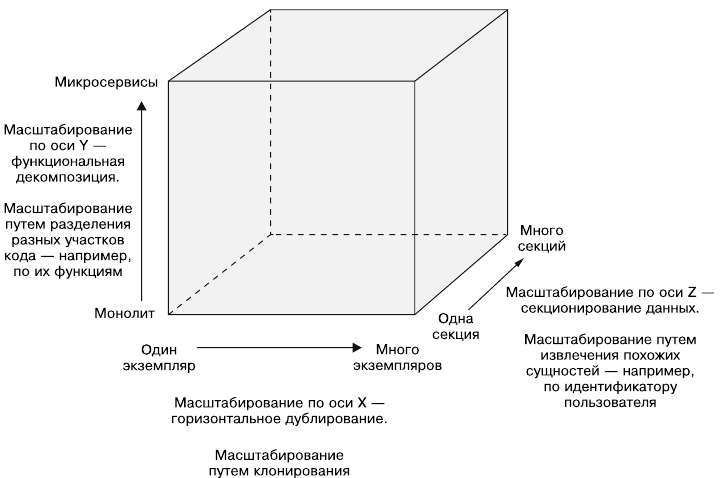

1. Ось X -  горизонтальное дублирование или клонирование всех данных, когда вы ставите рядом совершенно одинаковые хосты. Таким образом вы полностью копируете данные. Нужно это, прежде всего, чтобы система отвечала на запросы с каким-либо ожидаемым временем отклика. 

Масштабирование монолита за балансировщиками нагрузки

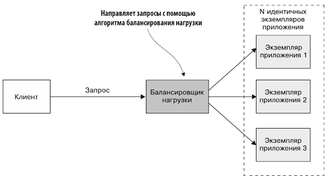

2. Ось Z - расположение однотипных, но разных данных на разных узлах. У вас есть ключ шардирования, по которому вы определяете, что у вас, например, данные на А и Б хранятся на одном узле, на В и Г — на другом узле и т. д. Таким образом, используя интеллектуальный выравниватель нагрузки, вы можете ее распределять по вашей системе и добиться более высокой производительности.

Каждый экземпляр отвечает за подмножество данных

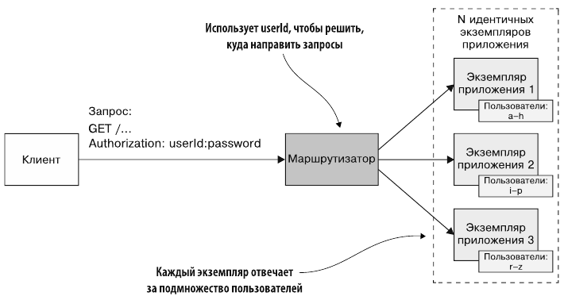

3. Ось Y - вы разбиваете функциональность по бизнес-задачам. Каждый сервис будет выполнять определенные задачи. Это и есть микросервисный подход. 

Разбиение монолита на сервисы по функциям


#### 45. Сервис-ориентированная архитектура и микросервисы.

**Сервис-ориентированная архитектура (SOA)** — модульный подход к разработке программного обеспечения, основанный на использовании распределённых, слабо связанных заменяемых компонентов, оснащённых стандартизированными интерфейсами для взаимодействия по стандартизированным протоколам.

**Микросервисы** - это небольшие модули, разделённые по принципу выполнения одной бизнес-задачи или одного класса задач. Основная цель такого разделения - возможность изменения, отдельно взятого микросервиса, не меняя при этом связанных с ним компонентов. Бизнес-логика приложения разбивается на отдельные части, каждая из которых представляет собой небольшое приложение, выполняющее одну бизнес-задачу (single responsibility). Число таких приложений ничем не ограничено и между собой они общаются, используя API, построенное, например, на основе HTTP.


SOA VS. МИКРОСЕРВИСЫ

SOA
- Межсервисное взаимодействие – умные каналы, сервисная шина предприятия (ESB), тяжеловесные протоколы типа SOAP
- Глобальная модель данных и общая БД
- Типовой сервис – крупное монолитное приложение

МИКРОСЕРВИСЫ
- Межсервисное взаимодействие – примитивные каналы, как брокер сообщений, прямое взаимоедйствие между сервисами по REST или gRPC
- Отдельные модели данных, своя БД у каждого сервиса
- Типовой сервис – небольшой сервис

**SOA** лучше подходит для больших, сложных корпоративных приложений, требующих интеграции со многими другими приложениями. При этом небольшие приложения не очень подходят для SOA, так как им не требуется компонент промежуточного программного обеспечения для обмена сообщениями. 

**Микросервисы** лучше подходят для небольших и хорошо разделенных веб-систем. Если вы разрабатываете мобильное или веб-приложение, то микросервисы дают вам гораздо больший контроль как разработчику. 

#### 46. Достоинства и недостатки микросервисов.

**Преимущества:**
- Четкое модульное деление. Позволит усилить модульную структуру — в вашей команде будут люди, которые прекрасно знают, как работает та или иная часть кода. Это особенно важно для больших команд разработчиков.
- Высокая доступность. Сервисы могут работать не все — при этом все остальное будет работать.
- Разнообразие технологий, или возможность использовать правильный инструмент. Например, если нужно построить хранилище данных, вы подберете тот инструмент, который действительно умеет хранить большие объемы данных и быстро их выбирать. Микросервисы позволяют даже просто опробовать технологию на каком-нибудь сервисе, и это не повлияет на другие сервисы, т. к. контракт изолирован через сетевое взаимодействие.
- Независимое развертывание из-за слабой связанности сервисов: простые сервисы проще разворачивать, и меньше вероятность отказа системы.

**Недостатки:**
- Сложность разработки.
- Конечная согласованность — бизнес вашего заказчика должен позволять работать с отложенными данными. Этим придется платить за высокую доступность. Классический пример конечной согласованности — банковские карты, транзакции между которыми могут занимать дня три. Из-за этого есть вероятность превышения кредитного лимита, и тогда начинает действовать простейший механизм компенсации — вам звонят из банка с просьбой погасить превышение.
- Сложность операционной поддержки — нужны грамотные DevOps-инженеры, непрерывное развертывание и автоматический мониторинг. Без всего этого микросервисы использовать не следует.

#### 47. Функциональная декомпозиция на сервисы.

Балансировка нагрузки и шардирование увеличивают мощность и доступность приложения. Но ни один из этих подходов не решает проблем с усложнением кода и процесса разработки. Чтобы справиться с ними, следует применить **функциональную декомпозицию** (разбиение). То как это работает, показано на рис. 1.6: монолитное приложение разбивается на отдельные сервисы.

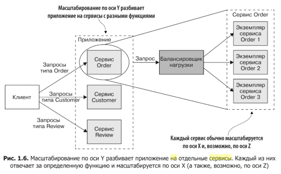

**Сервис**- это мини-приложение, реализующее узкоспециализированные функции, такие как управление заказами, управление клиентами и т.д. Сервисы масштабируются путем **_балансировки нагрузки_**, некоторые из них могут использовать также **_шардирование_** (деление БД на части). Например, сервис Order имеет несколько копий, нагрузка на которые балансируется.

**Обобщенное определение микросервисной архитектуры** (или микросервисов) звучит так: это стиль проектирования, который разбивает приложение на отдельные сервисы с разными функциями. Заметьте, что размер здесь вообще не упоминается. Главное, чтобы каждый сервис имел четкий перечень связанных между собой обязанностей.


#### 48. Команды и сервисы: размер, состав и закон Конвея.

ОРГАНИЗАЦИЯ ВОКРУГ ПОТРЕБНОСТЕЙ БИЗНЕСА

Микросервисный подход к разбиению подразумевает разбиение на сервисы в соответствии с потребностями бизнеса. 

Такие сервисы включают в себя полный набор технологий, необходимых для этой бизнес-потребности, в том числе пользовательский интерфейс, хранилице данных и любые внешние взаимодействия.

Это приводит к формированию кросс-функциональных команд, имеющих полный набор необходимых навыков: user-experience, базы данных и project management.

Закон Конвея: «Любая организация, которая проектирует какую-то систему (в широком смысле) получит дизайн, чья структура копирует структуру команд в этой организации»


Командные границы образуются в соответствии с сервисными границами и поддерживают их – обратный маневр Конвея

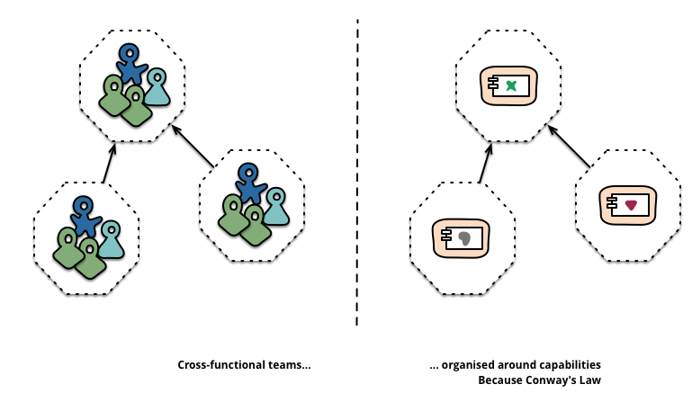

Размер и состав команды:

- «Команда двух пицц» - в команде должно быть людей столько, чтобы их можно было накормить двумя пиццами (до 12 человек по М.Фаулеру)
- Сервис должен быть настолько большим, чтобы он мог полностью «уместиться в голове разработчика», независимо от количества строк кода
- Продукты, а не проекты © М.Фаулер; «вы разработали, вам и поддерживать» © Amazon 🡪 методология DevOps 

#### 49. Проблемы и выгоды распределённости в микросервисной архитектуре.

**Выгоды:**
- Микросервисы легче держать модульными. Технически это обеспечивается жесткими границами между отдельными сервисами
- В больших компаниях разные сервисы могут принадлежать разным командам. Услуги могут быть повторно использованы всей компанией. Это также позволяет командам работать над услугами в основном самостоятельно. Нет необходимости координировать развертывание между командами.
- Микросервисы меньше, и благодаря этому их легче понять и проверить.Меньшие размеры помогают, когда речь идет о времени компиляции, времени запуска и времени, необходимом для выполнения тестов. Все эти факторы влияют на производительность разработчика, так как позволяют затрачивать меньше времени на ожидание на каждом этапе разработки.
- Микросервисы не привязаны к технологии, используемой в других сервисах. Значит мы можем использовать лучшие технологии подгонки. Старые сервисы могут быть быстро переписаны для использования новых технологий.
- В микросервисах изолируемые разломы лучше по сравнению с монолитным подходом. Хорошо спроектированная распределенная система переживет сбой одного сервиса.

**Проблемы:**
- Распределенная система имеет свою сложность: в ней вам приходится иметь дело с частичным отказом, более затруднительным взаимодействием при тестировании (тесты E2E), а также с более высокой сложностью при реализации взаимодействия между сервисами.
- Транзакции легче проводить в монолите. Решением этой проблемы на микросервисах является Saga Pattern.
- Существуют эксплуатационные накладные расходы, а множество микросервисов сложнее в эксплуатации, чем несколько экземпляров сигнального монолита.
- Для микросервисов может потребоваться больше оборудования, чем для традиционных монолитов
- Изменения, затрагивающие несколько сервисов, должны координироваться между несколькими командами, а это может быть сложно, если команды еще не имели контактов

#### 50. Стили взаимодействия микросервисов.

Стили взаимодействия микросервисов можно разделить на синхронные и асинхронные
**Синхронное** взаимодействие достаточно просто организовать, и оно гораздо проще для понимания. Человеческое сознание обладает единственным "потоком управления", представленным в виде фокуса внимания, и поэтому человеку проще понимать процессы, которые разворачиваются последовательно, поскольку не нужно постоянно переключать внимание на происходящие одновременно различные события. Код программы клиентского компонента, описывающей синхронное взаимодействие, устроен проще — его часть, отвечающая за обработку ответа сервера, находится непосредственно после части, в которой формируется запрос.
Вместе с тем, синхронное взаимодействие ведет к значительным затратам времени на ожидание ответа. Это время часто можно использовать более полезным образом: ожидая ответа на один запрос, клиент мог бы заняться другой работой, выполнить другие запросы, которые не зависят от еще не пришедшего результата. Поскольку все распределенные системы состоят из достаточно большого числа уровней, через которые проходят практически все взаимодействия, суммарное падение производительности, связанное с синхронностью взаимодействий, оказывается очень большим.

**Асинхронное** взаимодействие позволяет получить более высокую производительность системы за счет использования времени между отправкой запроса и получением ответа на него для выполнения других задач. Другое важное преимущество асинхронного взаимодействия — меньшая зависимость клиента от сервера, возможность продолжать работу, даже если машина, на которой находится сервер, стала недоступной. Это свойство используется для организации надежной связи между компонентами, работающей, даже если и клиент, и сервер не все время находятся в рабочем состоянии.
В то же время асинхронные взаимодействия более сложно использовать. Поскольку при таком взаимодействии нужно писать специфический код для получения и обработки результатов запросов, системы, основанные на асинхронных взаимодействиях между своими компонентами, значительно труднее разрабатывать и сопровождать. Чаще всего асинхронное взаимодействие реализуется при помощи очередей сообщений. При отправке сообщения клиент помещает его во входную очередь сервера, а сам продолжает работу. После того, как сервер обработает все предшествующие сообщения в очереди, он выбирает это сообщение для обработки, удаляя его из очереди. После обработки, если необходим ответ, сервер создает сообщение, содержащее результаты обработки, и кладет его во входную очередь клиента или в свою выходную.

Наиболее распространенными механизмами взаимодействия являются RPI-технологии(Remote Procedure Invocation), которые могут быть как синхронными так и асинхронными. Существуют множества реализаций RPI, самые популярные из которых REST, gRPC, AMQP.

**REST (Representational state transfer)** – это стиль архитектуры программного обеспечения для распределенных систем, таких как World Wide Web, который, как правило, используется для построения веб-служб. Термин REST был введен в 2000 году Роем Филдингом, одним из авторов HTTP-протокола. Системы, поддерживающие REST, называются RESTful-системами.
В общем случае REST является очень простым интерфейсом управления информацией без использования каких-то дополнительных внутренних прослоек. Каждая единица информации однозначно определяется глобальным идентификатором, таким как URL. Каждая URL в свою очередь имеет строго заданный формат.

**gRPC** — это высокопроизводительный фреймворк разработанный компанией Google для вызов удаленных процедур (RPC), работает поверх HTTP/2. gRPC простой в использовании, отлично подходит для создания распределенных систем (микросервисов) и API. Имеет встроенную поддержку для балансировки нагрузки, трассировки, аутентификации и проверки жизнеспособности сервисов. Есть возможность создавать клиентские библиотеки для работы с бэкендом на 10 языках. Высокая производительность достигается за счет использования протокола HTTP/2 и Protocol Buffers.

**AMQP (Advanced Message Queuing Protocol)** — открытый протокол для передачи сообщений между компонентами системы. Основная идея состоит в том, что отдельные подсистемы (или независимые приложения) могут обмениваться произвольным образом сообщениями через AMQP-брокер, который осуществляет маршрутизацию, возможно гарантирует доставку, распределение потоков данных, подписку на нужные типы сообщений.


#### 51. Удалённый вызов процедур: REST.

REST (Representational state transfer) – это стиль архитектуры программного обеспечения для распределенных систем, таких как World Wide Web, который, как правило, используется для построения веб-служб. Термин REST был введен в 2000 году Роем Филдингом, одним из авторов HTTP-протокола. Системы, поддерживающие REST, называются RESTful-системами.
В общем случае REST является очень простым интерфейсом управления информацией без использования каких-то дополнительных внутренних прослоек. Каждая единица информации однозначно определяется глобальным идентификатором, таким как URL. Каждая URL в свою очередь имеет строго заданный формат.

Отсутствие дополнительных внутренних прослоек означает передачу данных в том же виде, что и сами данные. Т.е. мы не заворачиваем данные в XML, как это делает SOAP и XML-RPC, не используем AMF, как это делает Flash и т.д. Просто отдаем сами данные.
Каждая единица информации однозначно определяется URL – это значит, что URL по сути является первичным ключом для единицы данных. Т.е. например третья книга с книжной полки будет иметь вид /book/3, а 35 страница в этой книге — /book/3/page/35. Отсюда и получается строго заданный формат. Причем совершенно не имеет значения, в каком формате находятся данные по адресу /book/3/page/35 – это может быть и HTML, и отсканированная копия в виде jpeg-файла, и документ Microsoft Word.
Как происходит управление информацией сервиса – это целиком и полностью основывается на протоколе передачи данных. Наиболее распространенный протокол конечно же HTTP. Так вот, для HTTP действие над данными задается с помощью методов: GET (получить), PUT (добавить, заменить), POST (добавить, изменить, удалить), DELETE (удалить). Таким образом, действия CRUD (Create-Read-Updtae-Delete) могут выполняться как со всеми 4-мя методами, так и только с помощью GET и POST.

#### 52. Удалённый вызов процедур: gRPC.

**gRPC** — это высокопроизводительный фреймворк разработанный компанией Google для вызов удаленных процедур (RPC), работает поверх HTTP/2.
gRPC простой в использовании, отлично подходит для создания распределенных систем (микросервисов) и API. Имеет встроенную поддержку для балансировки нагрузки, трассировки, аутентификации и проверки жизнеспособности сервисов. Есть возможность создавать клиентские библиотеки для работы с бэкендом на 10 языках. Высокая производительность достигается за счет использования протокола HTTP/2 и Protocol Buffers.

**Protocol Buffers (protobuf)**
Protobuf формат сериализации используемый по умолчанию для передачи данных между клиентом и сервером. Используя строгую типизацию полей и бинарный формат для передачи структурированных данных потребляет меньше ресурсов. Время выполнения процесса сериализации/десериализации значительно меньше как и размер сообщений в отличии от JSON/XML.
Для написания protobuf файлов используют язык описания интерфейсов (IDL). Например, чтобы описать структуру данных сообщения, нужно добавить message, имя структуры, а внутри тип, название и номер поля. Номера полей очень важны для обратной совместимости, поэтому не стоит менять их последовательность при добавлении или удалении полей. Старые номера можно резервировать. Пример:

```
message Profile {
    reserved 3; // Резервируем поле под номером 3
    int32 id = 1;
    string name = 2;
    int32 age = 4;
    string email = 5;

    enum PhoneType {
        MOBILE = 0;  // Поле 0 является значением по умолчанию
        HOME = 1;
        WORK = 2;
    }

    message PhoneNumber {
        string number = 1;
        PhoneType type = 2;
    }
    
    repeated PhoneNumber phones = 6;
}
```

**Типы RPC**

1. **Унарный** (Unary RPC).
Синхронный запрос клиента, который блокируются пока не будет получен ответ от сервера.
2. **Серверный стрим** (Server streaming RPC), при подключении клиента сервер открывает стрим и начинает отправлять сообщения.
3. **Клиентский стрим** (Client streaming RPC). То же самое, что и серверный, только клиент начинает стримить сообщения на сервер.
4. **Двунаправленный стрим** (Bidirectional streaming). Клиент инициализирует соединение, создаются два стрима. Сервер может отправить изначальные данные при подключении или отвечать на каждый запрос клиента по типу “пинг-понга”.

**Перехватчики (Interceptors)**

Выступают этакой заменой мидлварям, служат для перехвата вызовов и встраивания необходимых условий. Отлично подходят для логирования запросов, сбора метрик, аутентификации и т.д. 

**Балансировка нагрузки (Load Balancing)**

Выполняется на стороне клиента. Клиент использует простой “round-robin” алгоритм для передачи запросов по списку полученному от LB сервера. При желании на стороне LB сервера можно организовать более сложный алгоритм выдачи списка бэкенд сервисов клиенту использую LB политики.

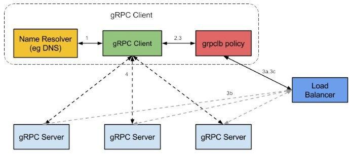

#### 53. Удалённый вызов процедур: механизм сообщений.

*Презентация ПРиС 11, слайд 13*

Клиент общается с сервисом посредством асинхронных сообщений. Обычно – с брокером сообщений

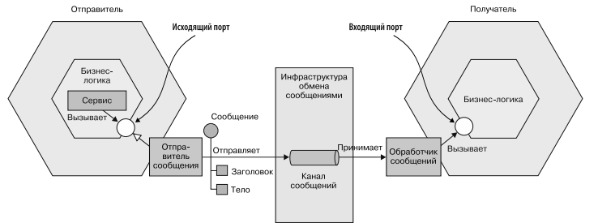

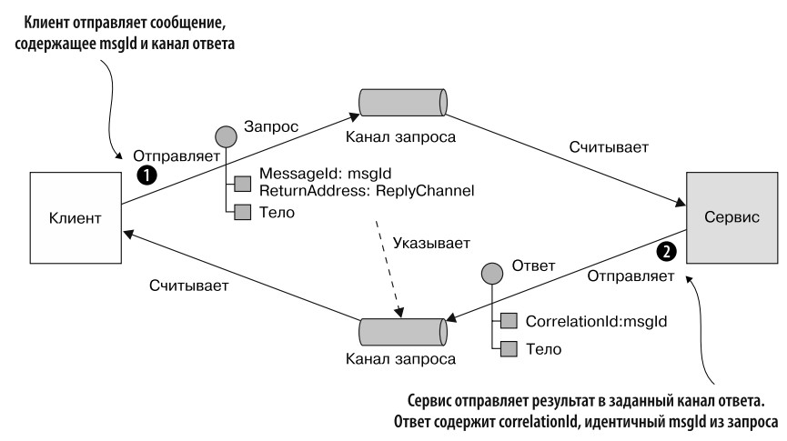

[Wiki](https://en.wikipedia.org/wiki/Message_passing)

**Передача сообщений** - это способ вызова поведения (например, запуска программы) на компьютере. Вызывающая программа отправляет сообщение процессу (который может быть актором или объектом ) и полагается на этот процесс и его вспомогательную инфраструктуру для выбора и последующего запуска выбранного кода. Передача сообщений отличается от обычного программирования, где процесс, подпрограмма или функция непосредственно вызывается по имени.

Передача сообщений повсеместно используется в современном ПО: используется объектами, составляющих программу, как один из способов работы друг с другом и как средство взаимодействия для объектов и систем, работающих на разных компьютерах (например, в интернете). Передача сообщений может осуществляться различными механизмами, включая каналы. 

Передача сообщений - это способ вызова поведения (например, запуска программы) на компьютере. В отличие от традиционного метода вызова программы по имени, передача сообщений использует объектную модель, чтобы отличить общую функцию от конкретных реализаций. Вызывающая программа отправляет сообщение и полагается на объект для выбора и выполнения соответствующего кода. Обоснования для использования промежуточного слоя делятся на две категории: инкапсуляция и распределение.

**Инкапсуляция** - идея о том, что программные объекты должны иметь возможность вызывать службы на других объектах, не зная и не заботясь о том, как эти службы реализуются. Инкапсуляция может уменьшить объем логики кодирования и сделать системы более удобными в обслуживании. Например, вместо операторов IF-THEN, которые определяют, какую подпрограмму или функцию вызывать, разработчик может просто отправить сообщение объекту, и объект выберет соответствующий код на основе типа сообщения.

**Распределение.** Распределенная передача сообщений предоставляет разработчикам уровень архитектуры, который обеспечивает общие службы для построения систем, состоящих из подсистем, работающих на разных компьютерах в разных местах и в разное время. Когда распределенный объект отправляет сообщение, уровень обмена сообщениями может решить такие проблемы, как:

* Поиск приложения с использованием различных операционных систем и языков программирования, в разных местах, откуда пришло сообщение.
* Сохранение сообщения в очереди, если соответствующий объект для обработки сообщения в данный момент не выполняется, а затем вызов сообщения, когда объект будет доступен. Кроме того, при необходимости хранение результата до тех пор, пока отправляющий объект не будет готов его принять.
* Управление различными транзакционными требованиями для распределенных транзакций (ACID-тестирование)

**Синхронная передача сообщений**

Синхронная передача сообщений происходит между объектами, которые работают одновременно.

Синхронный обмен сообщениями аналогичен вызову синхронной функции; точно так же, как вызывающая функция ожидает завершения функции, передающий процесс ждет завершения принимающего процесса. Это может сделать синхронную связь неработоспособной для некоторых приложений. Например, для больших распределенных систем. Обычно таким системам нужно работать даже в тех случаях, когда некоторые из их подсистем отключены для обсуживания и т. д.

Представьте себе занятый бизнес-офис, имеющий 100 настольных компьютеров, которые отправляют электронные письма друг другу, используя синхронную передачу сообщений исключительно. Один работник, выключив свой компьютер, может заморозить другие 99 компьютеров, пока этот работник не включит свой компьютер обратно для обработки одного сообщения электронной почты.

**Асинхронная передача сообщений**

При асинхронной передаче сообщений принимающий объект может быть неактивен или занят, когда запрашивающий объект отправляет сообщение. Продолжая аналогию с вызовом функции, это похоже на вызов функции, который возвращается немедленно, не дожидаясь завершения вызываемой функции. Сообщения отправляются в очередь, где они хранятся до тех пор, пока процесс получения не запросит их. Принимающий процесс обрабатывает свои сообщения и отправляет результаты в очередь для получения исходным процессом (или некоторым назначенным следующим процессом).

Асинхронный обмен сообщениями требует дополнительных возможностей для хранения и повторной передачи данных для систем, которые не могут работать одновременно и обычно обрабатываются программным обеспечением промежуточного уровня (middlware).

Буфер, необходимый в асинхронной связи, может вызвать проблемы, когда он заполнен. Необходимо принять решение, следует ли блокировать отправителя или отказаться от будущих сообщений. Заблокированный отправитель может привести к взаимоблокировке. Если отказаться от сообщений, то связь больше не является надежной.

**Гибриды**

Синхронная связь может быть построена поверх асинхронной связи с помощью синхронизатора . Например, α-синхронизатор работает, гарантируя, что отправитель всегда ожидает сообщения подтверждения от получателя. Отправитель отправляет следующее сообщение только после получения подтверждения. С другой стороны, асинхронная связь также может быть построена поверх синхронной связи. Например, современные микроядра обычно предоставляют только примитив синхронного обмена сообщениями, а асинхронный обмен сообщениями может быть реализован сверху с помощью вспомогательных потоков. 

#### 54. Проблемы запроса данных из нескольких сервисов. Объединение API.

>todo

#### 55. CQRS. Запрашивающий сервис.

>todo

#### 56. Процесс и стратегии перехода от монолита к микросервисам.

**Стратегий перехода от монолита к микросервисам**

1. **Разбиение монолита путем оформления функциональности в виде сервисов**
   Самая простая из них и почти всегда неправильная — разработать микросервисную архитектуру с нуля, используя монолитное приложение, как пример для подражания. Наверное, распространенность такого подхода и есть главным аргументом приверженцев писать приложения сразу на микросервисах. Но это серьезно добавляет стоимости к изначальной разработке приложения.

2. **Реализация новых возможностей в виде сервисов**
   Более адекватным подходом перехода от монолита к микросервисам является постепенное отпочковывание микросервисов и написание новой функциональности уже отдельно от основного приложения. Подход хороший и рабочий, но имеет один существенный недостаток — основное монолитное приложение в обозримом будущем не исчезнет. В итоге у нас будет монолит и куча вспомогательных сервисов, вместо набора независимых микросервисов.

3. **Разделение уровня представления и внутренних компонентов**
   В конечном счете, вменяемым способом перейти к микросервисной архитектуре можно назвать способ, при котором основное монолитное приложение разбивается на несколько крупнокалиберных приложений с сильной взаимной связностью. После чего подприложения рассматриваются и рефакторятся отдельно, попутно задевая соседей и заставляя их приспосабливаться и изменяться вместе. Постепенно такой подход приведет к уменьшению связности и появлению устоявшегося интерфейса каждого подприложения. При достижении такой вот устоявшейся временной точки, представляется возможным вносить изменения в подприложения, не затрагивая при этом соседние. И это подприложение рассматривается, как монолит попроще и уровнем ниже. И с ним проделываются аналогичные процедуры. Постепенно приложение бьется на более-менее равные части. Некоторые части в процессе становятся ненужными, некоторые дублируют уже существующие другие части или вообще сливаются в один общий сервис для устранения дублирования. В итоге рано, или скорее поздно, получается устоявшееся приложение на микросервисной архитектуре.

#### 57. Определение и история DevOps. Концепции разработки, релиза и развертывания ПО.

>todo

#### 58. Непрерывная сборка и развертывание. Конвейер непрерывного развертывания: автоматизация сборки, тестирование, развертывание, эксплуатация.

>todo
