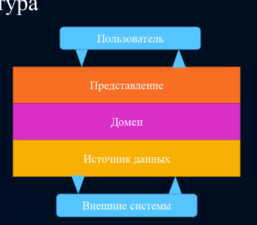

#### 1. Эталонная модель взаимодействия открытых систем и стек TCP/IP.

>todo

#### 2. Серверы и серверное ПО.

>todo

#### 3. Стеки LAMP, MEAN и др.

>todo

#### 4. Противоречия между целями бизнеса и разработчиков. Поведение или архитектура.

>todo

#### 5. Три уровня архитектуры программной системы.

>todo

#### 6. Парадигмы программирования: структурное. Ограничения, выгода.

>todo

#### 7. Парадигмы программирования: объектно-ориентированное. Ограничения, выгода.

>todo

#### 8. Парадигмы программирования: функциональное. Ограничения, выгода.

>todo

#### 9. SOLID: принцип единственной ответственности (SRP), принцип открытости-закрытости (OCP).

>todo

#### 10. SOLID: принцип подстановки Барбары Лисков (LSP), принцип разделения интерфейсов (ISP).

>todo

#### 11. SOLID: принцип инверсии зависимостей (DIP).

>todo

#### 12. Принципы связности компонентов. Их противоречия.

>todo

#### 13. Принципы сочетаемости компонентов.

>todo

#### 14. Бизнес-логика и бизнес-правила.

>todo

#### 15. Горизонтальное и вертикальное разбиение приложения.

>todo

#### 16. Режимы разделения приложения.

>todo

#### 17. Границы. Пересечение границ.

>todo

#### 18. Большой Комок Грязи и концептуальные недостатки фреймворков.

**БОЛЬШОЙ КОМОК ГРЯЗИ** - беспорядочный, сырой, словно перемотанный на скорую руку изоляционной лентой и проводами, запутавшийся в джунглях спагетти-код. Мы все видели такой код. В этих системах легко найти признаки нерегулируемого роста и постоянных доделок. Информация распространяется без разбора между отдаленными элементами системы, при этом зачастую вся важная информация становится глобальной или дублируется. Структура системы в целом никогда не было точно определена. Если и была, то ее разрушили до такой степени, что оригинал уже не узнать. Программисты хоть немного понимающие архитектуру, обходят это болото стороной. И только те, кого она волнует мало и, возможно, те, кому нравится латать дыры в системе каждый день, довольны работой таких систем.

Почему система превращается в БОЛЬШОЙ КОМОК ГРЯЗИ? Иногда большие и страшные системы появляются из-за создания разового кода. **Разовый код** – это быстрый, черновой вариант кода, который должен был использоваться только один раз, а затем выброшен. Однако иногда такой код начинает жить собственной жизнью, несмотря на свою не проработанную структуру и плохо разработанную документацию или ее отсутствие. Он работает, зачем что-то чинить? Когда возникает какая-то проблема, то самый быстрый способ решить ее — изменить работающий код. Это избавляет от необходимости создавать программу с нуля, но со временем, простые разовые программы порождают БОЛЬШОЙ КОМОК ГРЯЗИ.

Даже системы с хорошо прописанной архитектурой рискуют пострадать от распада структуры. Любая успешная система находится под огнём постоянно изменяющихся требований, что постепенно подрывает ее структуру. Некогда чистые системы зарастают из-за поэтапного роста структуры, и элементы системы начинают разрастаться бесконтрольно.
Если не прекратить этот рост, то структура системы нарушается до такой степени, что от нее нужно отказываться.

Так как понимание системы становится все труднее, ее поддержка становится сложнее и обходится все дороже. Хорошие программисты отказываются работать с такой структурой. Один из способов остановить энтропию в ПО — перепроектирование (рефракторинг). Приверженность периодическому рефакторингу может защитить систему от сползания в БОЛЬШОЙ КОМОК ГРЯЗИ. В более серьезных случаях, трудно найти альтернативу, поэтому все сносят и начинают строительство заново.

**Концептуальные недостатки фреймворков**

1. Прежде чем воспользоваться всеми прелестями фреймворка вы должны потратить своё время на то, чтобы узнать, как использовать его.

2. Если задуматься, то термин «готовые к использованию» подразумевает под собой «одно решение для всех», когда фреймворк пытается решить проблемы всех пользователей для каждой ситуации, может случиться так, что разработчик столкнётся с огромным количеством ненужного ему кода.

3. Так как готовые решения сделаны для массового потребителя, вы можете быть почти уверены в том, что вам придётся что-то настраивать под себя для удовлетворения потребностей вашего проекта, что занимает дополнительное время.

4. Во многих случаях, фреймворки не могут покрыть все потребности разработчика, что приводит к дополнительной интеграции сторонних компонентов (например, в виде раздутых плагинов JQuery и т.п.).

5. Практически, вы не имеете никакого контроля над кодом. При этом, если команда разработчиков решит удалить какой-то компонент фреймворка, то вы будете вынуждены признать это изменение. Иначе, если вы не хотите соглашаться с их мнением, придётся модифицировать фреймворк или использовать старую версию их продукта.

Многие фреймворки были созданы для определенных задач и целей, исходя из этого можем сделать вывод, что использование фреймворка это не панацея.
Плохих и хороших фреймворков нет. Для каждой отдельной задачи подходит свое решение и свой фреймворк.

#### 19. Трёхслойная архитектура М.Фаулера.

Фаулер и руководство компании Microsoft по проектированию архитектуры приложений выделяют три слоя абстракции, на которые можно разделить разрабатываемое приложение.

**Первый слой абстракции** — это слой доступа к данным. В задачи данного слоя входит абстрагирование от базы данных. SQL-запросы к базе данных, в которой и хранятся данные приложения, скрываются за фасадом, который использует бизнес-слой.

**Второй слой абстракции** — это слой бизнес-логики. Он содержит объекты предметной области, а также функции для работы с ними. Эти функции и реализуют данную бизнес-логику.

**Третий слой абстракции** — это слой взаимодействия с пользователем. Данный слой включает компоненты пользовательского интерфейса.

**Преимущества**:

1. Подход делает возможным параллельную разработку и тестирование каждого из слоев
2. Позволяет изменять структуру или полностью заменять один из слоев не изменяя другие

**Главный недостаток**:

1. Зависимость бизнес-логики от системы хранения

#### 20. Чистая архитектура Р.Мартина.

>todo

#### 21. Порты и Адаптеры А.Кокберна. Уровни гексагональной архитектуры.

>todo

#### 22. Правило зависимостей и инверсия зависимостей в гексагональной архитектуре.

>todo

#### 23. Типовые решения организации бизнес-логики: сценарий транзакции.

>todo

#### 24. Типовые решения организации бизнес-логики: модель предметной области.

>todo

#### 25. Типовые решения организации бизнес-логики: модуль таблицы.

>todo

#### 26. Слой служб.

>todo

#### 27. Предметно-ориентированное проектирование. Определение, цели, задачи.

>todo

#### 28. Стратегическое проектирование DDD. Концепции.

>todo

#### 29. Единый язык и ограниченные контексты.

>todo

#### 30. Подобласти. Смысловое ядро.

>todo

#### 31. Способы связывания контекстов: общее ядро, партнёрство, клиент-поставщик.

>todo

#### 32. Способы связывания контекстов: конформист, предохранительный уровень, службы с открытым протоколом.

>todo

#### 33. Способы связывания контекстов: общедоступный язык, отдельное существование.

>todo

#### 34. Технологические нюансы связывания контекстов.

>todo

#### 35. Сущность. Объект значений. Фабрика.

>todo

#### 36. Сервисы доменные, прикладные, инфраструктурные.

>todo

#### 37. Агрегат. Генерация идентичности. Репозиторий.

>todo

#### 38. Правила агрегатов. Свойства агрегатов.

>todo

#### 39. Доменные события. Надёжность публикации.

>todo

#### 40. Сага. Компенсирующие транзакции.

>todo

#### 41. Хореография и оркестрация саги.

>todo

#### 42. Порождение событий (ES).

>todo

#### 43. Чем плох монолит?

>todo

#### 44. Куб масштабирования систем.

>todo

#### 45. Сервис-ориентированная архитектура и микросервисы.

>todo

#### 46. Достоинства и недостатки микросервисов.

>todo

#### 47. Функциональная декомпозиция на сервисы.

>todo

#### 48. Команды и сервисы: размер, состав и закон Конвея.

>todo

#### 49. Проблемы и выгоды распределённости в микросервисной архитектуре.

>todo

#### 50. Стили взаимодействия микросервисов.

>todo

#### 51. Удалённый вызов процедур: REST.

>todo

#### 52. Удалённый вызов процедур: gRPC.

>todo

#### 53. Удалённый вызов процедур: механизм сообщений.

>todo

#### 54. Проблемы запроса данных из нескольких сервисов. Объединение API.

>todo

#### 55. CQRS. Запрашивающий сервис.

>todo

#### 56. Процесс и стратегии перехода от монолита к микросервисам.

**Стратегий перехода от монолита к микросервисам**

1. **Разбиение монолита путем оформления функциональности в виде сервисов**
   Самая простая из них и почти всегда неправильная — разработать микросервисную архитектуру с нуля, используя монолитное приложение, как пример для подражания. Наверное, распространенность такого подхода и есть главным аргументом приверженцев писать приложения сразу на микросервисах. Но это серьезно добавляет стоимости к изначальной разработке приложения.

2. **Реализация новых возможностей в виде сервисов**
   Более адекватным подходом перехода от монолита к микросервисам является постепенное отпочковывание микросервисов и написание новой функциональности уже отдельно от основного приложения. Подход хороший и рабочий, но имеет один существенный недостаток — основное монолитное приложение в обозримом будущем не исчезнет. В итоге у нас будет монолит и куча вспомогательных сервисов, вместо набора независимых микросервисов.

3. **Разделение уровня представления и внутренних компонентов**
   В конечном счете, вменяемым способом перейти к микросервисной архитектуре можно назвать способ, при котором основное монолитное приложение разбивается на несколько крупнокалиберных приложений с сильной взаимной связностью. После чего подприложения рассматриваются и рефакторятся отдельно, попутно задевая соседей и заставляя их приспосабливаться и изменяться вместе. Постепенно такой подход приведет к уменьшению связности и появлению устоявшегося интерфейса каждого подприложения. При достижении такой вот устоявшейся временной точки, представляется возможным вносить изменения в подприложения, не затрагивая при этом соседние. И это подприложение рассматривается, как монолит попроще и уровнем ниже. И с ним проделываются аналогичные процедуры. Постепенно приложение бьется на более-менее равные части. Некоторые части в процессе становятся ненужными, некоторые дублируют уже существующие другие части или вообще сливаются в один общий сервис для устранения дублирования. В итоге рано, или скорее поздно, получается устоявшееся приложение на микросервисной архитектуре.

#### 57. Определение и история DevOps. Концепции разработки, релиза и развертывания ПО.

>todo

#### 58. Непрерывная сборка и развертывание. Конвейер непрерывного развертывания: автоматизация сборки, тестирование, развертывание, эксплуатация.

>todo
